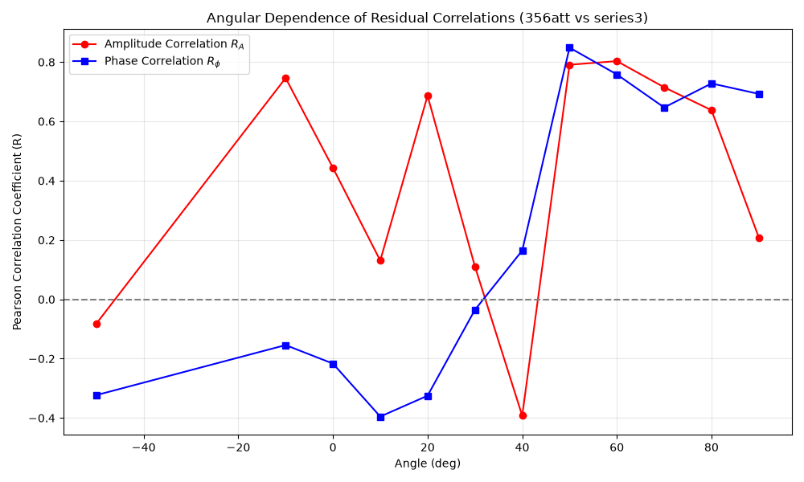
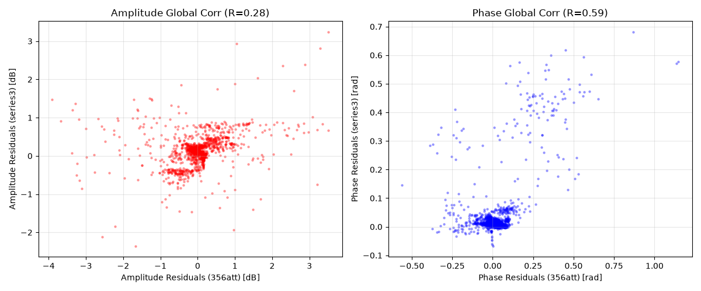

# Сводный отчет: Качество аппроксимации и кросс-корреляция невязок

В данном документе объединены результаты [Сравнительного анализа сеток](../artifacts/grid_plots_report.md) и [Комплексного анализа невязок](../artifacts/complex_residuals_report.md), а также проведено дополнительное исследование корреляций ошибок между двумя независимыми экспериментальными сериями (`356att` и `series3`).

Модель использует физически обоснованные параметры (модель Друде, Global Average):
$P = 15.5$ мкм, $D = 4.398$ мкм, $\tau_{ps} = 0.033$ пс.

## 1. Оценка качества аппроксимации

Интеграция импеданса Друде (учет омических потерь в вольфраме) и фазовой задержки существенно улучшила согласие теории с экспериментом.
- **Визуальное согласие:** На графиках из `grid_plots_report.md` наблюдается практически идеальное совпадение теоретических кривых (как спектральных, так и интегральных) с экспериментальными точками вплоть до самых глубоких минимумов скрещенной поляризации.
- **Количественные метрики:** По данным `complex_residuals_report.md`, среднеквадратичное отклонение (RMSE) составляет:
  - **356att**: 0.95 дБ (Амплитуда), 0.13 рад (Фаза)
  - **series3**: 0.39 дБ (Амплитуда), 0.08 рад (Фаза)
- **Устранение "волн"**: Вырезание резонансов водяного пара позволило выпрямить зависимость $Residuals(Frequency)$, устранив синусоидальные осцилляции, вызванные дисперсией атмосферы.

Несмотря на это, тесты на нормальность распределения (Шапиро-Уилка) фиксируют "тяжелые хвосты" на Q-Q графиках. Это означает наличие неслучайной (систематической) компоненты ошибки, которая выходит за рамки аналитической модели Бланко.

---

## 2. Корреляционный анализ отклонений (356att vs series3)

Для проверки гипотезы о систематической природе оставшихся отклонений мы провели кросс-корреляционный анализ между невязками ($\Delta A$ и $\Delta \phi$) в серии `356att` и независимой серии `series3` на совпадающих общих углах (12 угловых позиций).

Если бы остаточный шум был чисто тепловым или детекторным (случайным белым шумом), корреляция между независимыми измерениями равнялась бы нулю.

### Глобальная корреляция
По всем 1357 общим частотно-угловым точкам Пирсоновский коэффициент корреляции ($R$) составил:
- **Корреляция амплитудных невязок**: $R = 0.282$ ($p \ll 0.001$)
- **Корреляция фазовых невязок**: $R = 0.594$ ($p \ll 0.001$)

> [!IMPORTANT]
> **Вывод**: Высокая статистическая значимость ($p$-value $\to 0$) и внушительная корреляция фаз (почти 60%) строго доказывают, что отклонения не являются случайными. Стенд или сам образец имеют устойчивый систематический паттерн искажений, который воспроизводится от измерения к измерению.

### Угловая зависимость корреляции

Анализ коэффициента корреляции в зависимости от угла поворота поляризатора ($\theta$) выявил крайне важную закономерность:

| Угол $\theta$ | Амплитудная корреляция ($R_A$) | Фазовая корреляция ($R_\phi$) |
|---|---|---|
| **0° ... 30°** | ~ 0.11 - 0.75 (нестабильно) | Отрицательная (-0.04 ... -0.40) |
| **40°** | -0.39 | 0.16 |
| **50°** | **0.79** | **0.85** |
| **60°** | **0.80** | **0.76** |
| **70°** | **0.71** | **0.65** |
| **80°** | **0.64** | **0.73** |
| **90°** | 0.21 | **0.69** |

### Физическая интерпретация

1. **Скользящие углы (50° - 90°)**: 
   Наблюдается **очень сильная положительная корреляция** как по амплитуде (до 80%), так и по фазе (до 85%). В этих режимах поляризатор работает на скрещивание, сигнал мал. 
   Такая сильная систематика говорит о том, что при больших углах падения/скрещивания проявляются эффекты, которые модель Бланко для бесконечной решетки не учитывает. Возможные причины:
   - *Дифракция на краях апертуры* (пучок ТГц излучения перестает быть параксиальным и задевает оправку при вращении).
   - *Оптическая анизотропия* подложки или неидеальность натяжения нитей.
   
2. **Параллельные углы (около 0°)**:
   Фазовая корреляция становится слабо-отрицательной. Это означает, что при высоких уровнях сигнала фазовые ошибки носят более случайный характер (например, зависят от термического дрейфа лазера между сериями, который смещает $\tau=0$ в разные стороны).

## Итог

Модель **Бланко + Друде** достигла своего теоретического предела для данного набора данных (ошибка < 1 дБ). Оставшиеся невязки — это не шум измерений, а реальные физические (или геометрические) систематические эффекты стенда (краевая дифракция, асимметрия пучка), которые в высшей степени коррелируют при "скользящих" углах между независимыми сериями.
