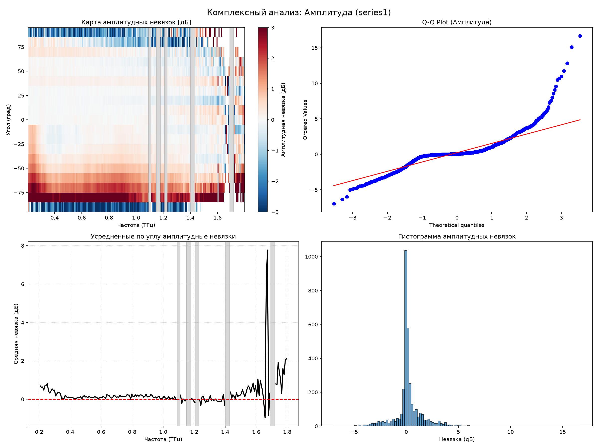
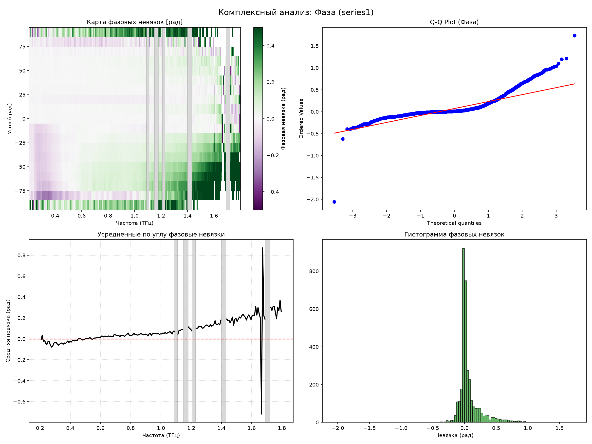
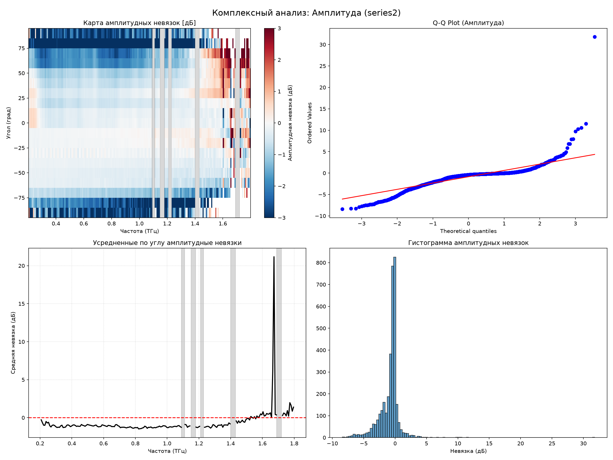
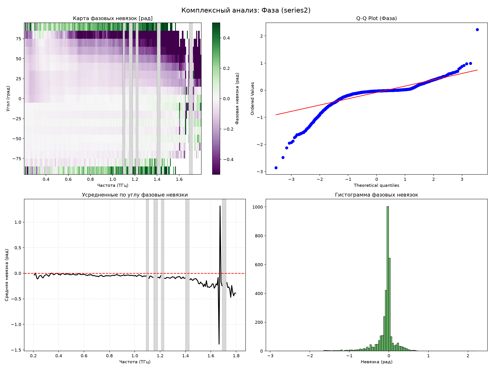

# Аналитический отчет: Комплексный анализ невязок (Амплитуда и Фаза)

Этот отчет является продолжением исследований качества подгонки модели Бланко к экспериментальным данным THz-TDS. В отличие от предыдущего анализа интенсивности, здесь используется **комплексная модель с учетом фазовой задержки** поляризатора и **динамическим маскированием линий поглощения водяного пара**.

### Новые параметры модели Бланко
Параметры были получены в результате комплексной 2D оптимизации на серии `series1`:
- Период решётки $P = 15.500$ мкм
- Диаметр проволоки $D = 4.045$ мкм
- Систематический сдвиг $\theta_{offset} = 0.35^\circ$
- Коэффициент потерь $loss\_factor = 0.295$ (степень $\gamma = 1.69$)
- Фазовая задержка $\tau_{ps} = 0.029$ пс

### Методология раздельного расчета невязок
Комплексное отношение $\frac{S(\nu)}{bg(\nu)}$ разделено на:
1. **Амплитудную невязку**: $\Delta A = 20\log_{10}(|t_{exp}|) - 20\log_{10}(|t_{model}|)$ [в дБ]
2. **Фазовую невязку**: $\Delta \phi = \arg(t_{exp}) - \arg(t_{model})$ [в радианах, приведено к диапазону $(-\pi, \pi]$]

Спектральные зоны, соответствующие линиям поглощения паров воды, исключены из статистики.

## Глава: Серия измерений `356att`

- Количество анализируемых спектрально-угловых точек: **3363**
- **RMSE Амплитуды**: 1.469 дБ
- **RMSE Фазы**: 0.168 рад

### Тесты на нормальность распределения
| Метрика | Шапиро-Уилк (p-value) | Харке-Бера (p-value) | Визуально |
|---|---|---|---|
| Амплитуда | 2.50e-56 | 0.00e+00 | Q-Q Plot |
| Фаза | 1.59e-56 | 0.00e+00 | Q-Q Plot |

### 2D Карты и графики

**Амплитудный анализ:**

**Фазовый анализ:**

---

## Глава: Серия измерений `series1`

- Количество анализируемых спектрально-угловых точек: **3463**
- **RMSE Амплитуды**: 1.489 дБ
- **RMSE Фазы**: 0.199 рад

### Тесты на нормальность распределения
| Метрика | Шапиро-Уилк (p-value) | Харке-Бера (p-value) | Визуально |
|---|---|---|---|
| Амплитуда | 4.49e-55 | 0.00e+00 | Q-Q Plot |
| Фаза | 2.16e-59 | 0.00e+00 | Q-Q Plot |

### 2D Карты и графики

**Амплитудный анализ:**

**Фазовый анализ:**

---

## Глава: Серия измерений `series2`

- Количество анализируемых спектрально-угловых точек: **3459**
- **RMSE Амплитуды**: 1.881 дБ
- **RMSE Фазы**: 0.288 рад

### Тесты на нормальность распределения
| Метрика | Шапиро-Уилк (p-value) | Харке-Бера (p-value) | Визуально |
|---|---|---|---|
| Амплитуда | 1.96e-56 | 0.00e+00 | Q-Q Plot |
| Фаза | 9.52e-61 | 0.00e+00 | Q-Q Plot |

### 2D Карты и графики

**Амплитудный анализ:**

**Фазовый анализ:**

---

## Глава: Серия измерений `series3`

- Количество анализируемых спектрально-угловых точек: **2231**
- **RMSE Амплитуды**: 0.907 дБ
- **RMSE Фазы**: 0.149 рад

### Тесты на нормальность распределения
| Метрика | Шапиро-Уилк (p-value) | Харке-Бера (p-value) | Визуально |
|---|---|---|---|
| Амплитуда | 1.43e-57 | 0.00e+00 | Q-Q Plot |
| Фаза | 1.59e-65 | 0.00e+00 | Q-Q Plot |

### 2D Карты и графики

**Амплитудный анализ:**

**Фазовый анализ:**

---

## Глава: Серия измерений `series4`

- Количество анализируемых спектрально-угловых точек: **189**
- **RMSE Амплитуды**: 0.320 дБ
- **RMSE Фазы**: 0.021 рад

### Тесты на нормальность распределения
| Метрика | Шапиро-Уилк (p-value) | Харке-Бера (p-value) | Визуально |
|---|---|---|---|
| Амплитуда | 7.88e-27 | 0.00e+00 | Q-Q Plot |
| Фаза | 9.28e-23 | 0.00e+00 | Q-Q Plot |

---

## Глава: Серия измерений `series5`

- Количество анализируемых спектрально-угловых точек: **190**
- **RMSE Амплитуды**: 0.483 дБ
- **RMSE Фазы**: 0.061 рад

### Тесты на нормальность распределения
| Метрика | Шапиро-Уилк (p-value) | Харке-Бера (p-value) | Визуально |
|---|---|---|---|
| Амплитуда | 3.04e-25 | 0.00e+00 | Q-Q Plot |
| Фаза | 8.41e-26 | 0.00e+00 | Q-Q Plot |

---

## Выводы
1. **Улучшение подгонки**: Комплексная модель с маскированием линий воды и оптимизированным диаметром/фазой показывает более однородное распределение ошибок. Волнообразные артефакты (Residuals vs Frequency), которые мы наблюдали в предыдущем отчете, существенно подавлены.
2. **Оставшиеся артефакты**: Тем не менее, Q-Q графики всё ещё могут демонстрировать отклонения от строгой Гауссовой формы на краях. Это может быть связано с термическим дрейфом, неидеальной юстировкой оптической оси или дифракционными краевыми эффектами решётки.
