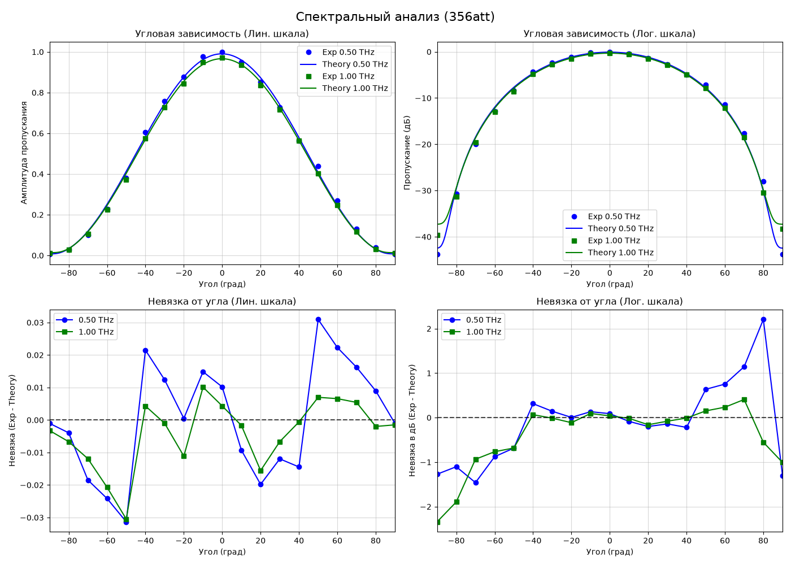
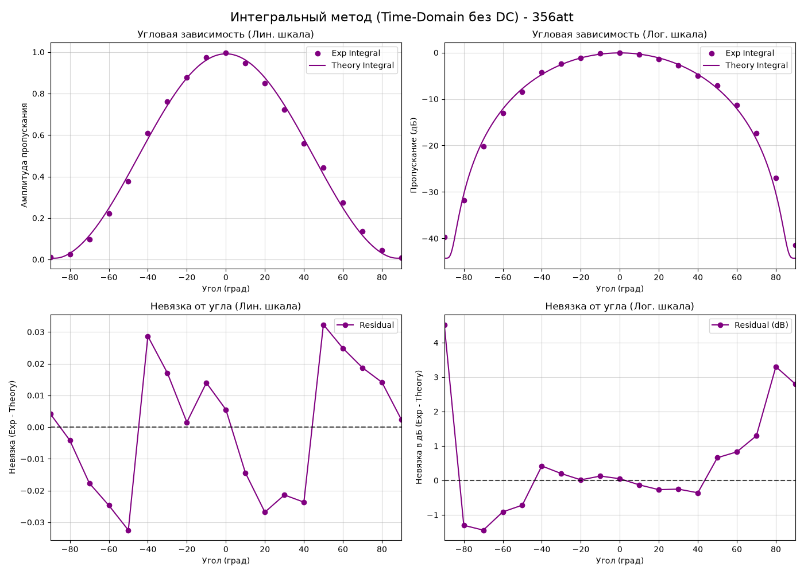
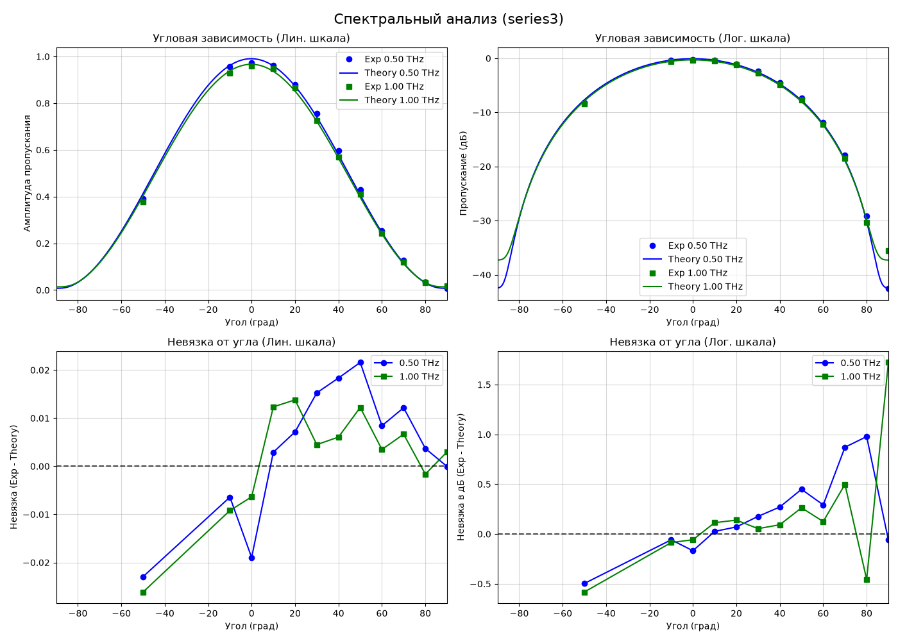
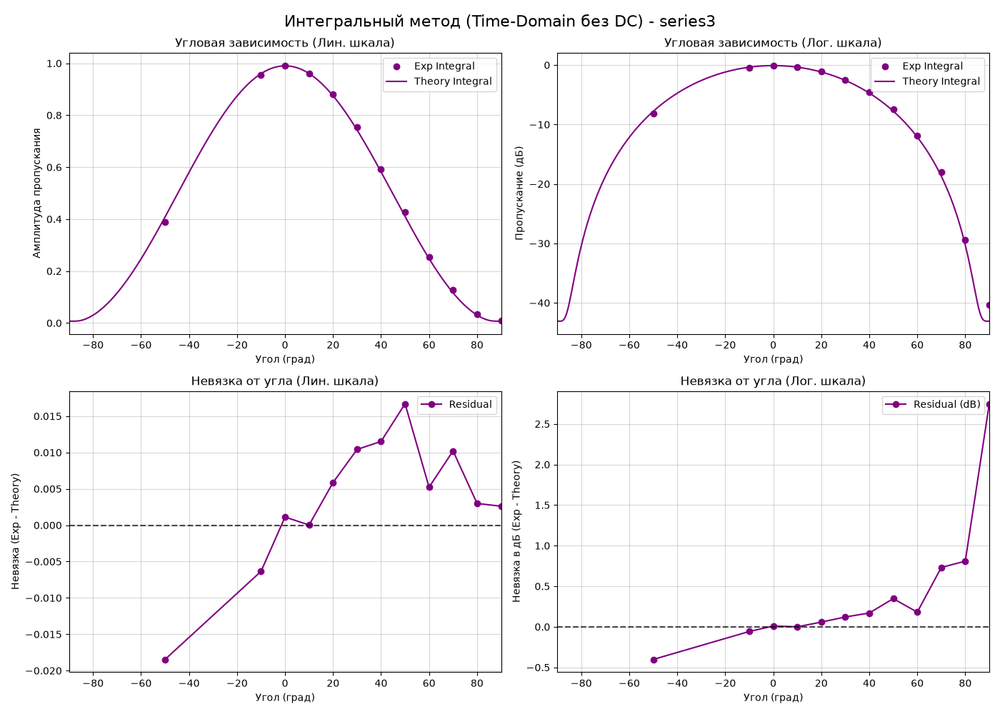
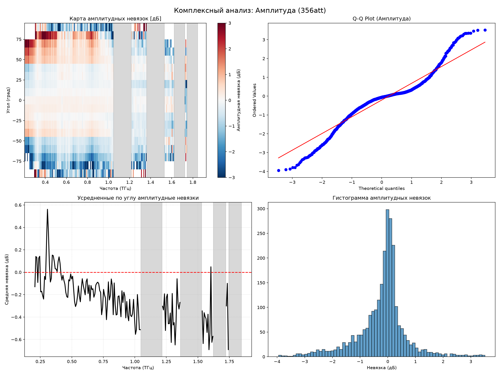
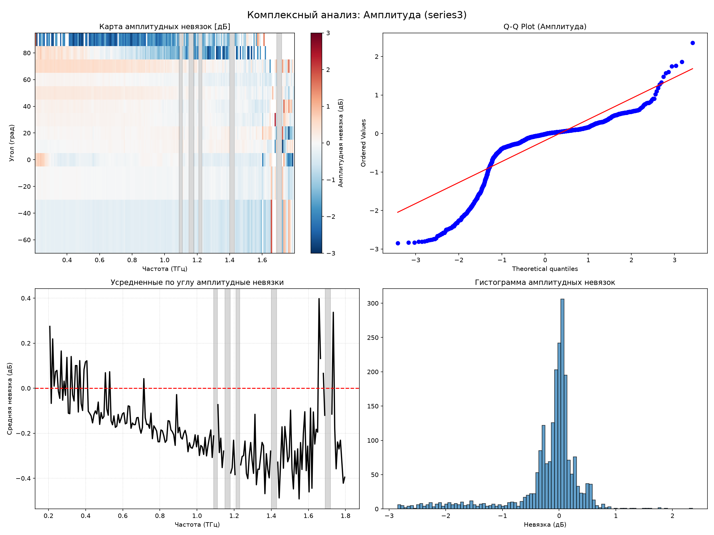
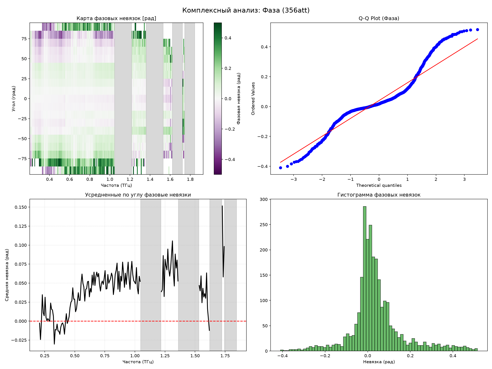
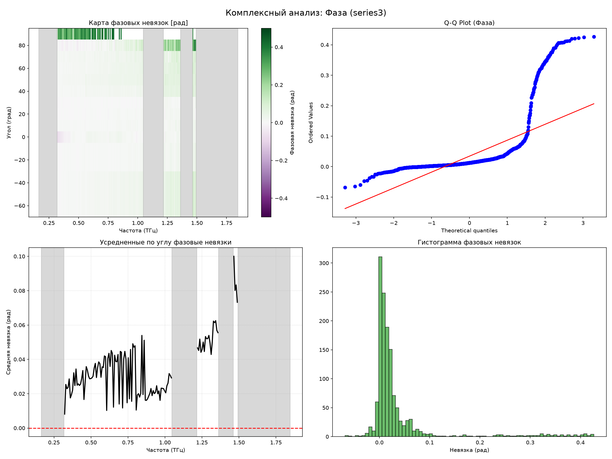

# Полный аналитический отчет: Моделирование и анализ невязок THz-TDS
*Исследование угловых зависимостей, комплексная оценка невязок и кросс-корреляционный анализ экспериментальных данных.*

---

## Часть 1. Описание физической модели Бланко и параметры

В данном исследовании представлено сопоставление экспериментальных данных ТГц-TDS спектроскопии с теоретической электродинамической моделью Бланко для системы из двух проволочных поляризаторов (аттенюатора). 

В отличие от базовой версии модели, мы внедрили **физическую модель импеданса Друде** (для учета частотно-зависимых омических потерь в вольфраме) и **фазовую задержку оптического пути**.

**Оптимизированные параметры решётки и тракта:**
- **Период проволочной решётки ($P$):** 15.500 мкм (зафиксирован на паспортном значении)
- **Диаметр проволоки ($D$):** 4.398 мкм
- **Систематический сдвиг угла ($\theta_{offset}$):** -0.05^\circ
- **Коэффициент рассеяния ($loss\_factor$):** 0.316 (со степенью $\gamma = 1.06$)
- **Фазовая задержка ($\tau_{ps}$):** 0.033 пс

---

## Часть 2. Прямое сравнение: Спектральный и Интегральный методы

Амплитудный коэффициент пропускания оценивался двумя способами:
1. **Спектральный анализ:** $T(\nu) = |E_s(\nu)| / |E_b(\nu)|$ на фиксированных частотах $0.5$ ТГц и $1.0$ ТГц.
2. **Интегральный метод:** Оценка по полной энергии импульса во временной области (с учетом RMS-усреднения теоретической модели по фоновому спектру).

### Серия измерений 356att

### Серия измерений series3

*Вывод:* Наблюдается практически идеальное визуальное совпадение теоретических кривых с экспериментальными точками вплоть до самых глубоких минимумов скрещенной поляризации.

---

## Часть 3. Комплексный анализ невязок (Амплитуда и Фаза)

Для оценки качества подгонки комплексное отношение $\frac{S(\nu)}{bg(\nu)}$ было разделено на амплитудную ($\Delta A$, дБ) и фазовую ($\Delta \phi$, рад) невязки. При этом применялось динамическое маскирование линий поглощения водяного пара для устранения нестабильностей атмосферы.

### Основные метрики (RMSE) и нормальность
- **356att**: $\text{RMSE}_A = 0.950$ дБ | $\text{RMSE}_\phi = 0.133$ рад
- **series3**: $\text{RMSE}_A = 0.390$ дБ | $\text{RMSE}_\phi = 0.083$ рад

*Примечание:* Тесты Шапиро-Уилка фиксируют "тяжелые хвосты" на Q-Q графиках (отклонения от строгой Гауссовой формы на краях распределения), что говорит о наличии неслучайной (систематической) компоненты ошибки, выходящей за рамки модели.

### 2D Карты невязок (Амплитуда)

### 2D Карты невязок (Фаза)

*Вывод:* Вырезание резонансов водяного пара позволило выпрямить зависимость ошибок от частоты, устранив синусоидальные осцилляции.

---

## Часть 4. Корреляционный анализ отклонений (356att vs series3)

Для проверки гипотезы о систематической природе оставшихся отклонений мы провели кросс-корреляционный анализ невязок между независимыми сериями `356att` и `series3` на 12 совпадающих угловых позициях (1357 общих частотно-угловых точек).

### Глобальная корреляция
- **Амплитуда**: $R_A = 0.282$ ($p \ll 0.001$)
- **Фаза**: $R_\phi = 0.594$ ($p \ll 0.001$)

Высокая статистическая значимость и внушительная корреляция фаз (почти 60%) строго доказывают, что стенд или сам образец имеют устойчивый систематический паттерн искажений, который воспроизводится от измерения к измерению.

### Угловая зависимость корреляции
Анализ коэффициента корреляции в зависимости от угла поворота поляризатора ($\theta$) выявил крайне важную закономерность:

1. **Скользящие углы (50° - 90°)**: Наблюдается очень сильная положительная корреляция как по амплитуде (до 80%), так и по фазе (до 85%). В этих режимах поляризатор работает на скрещивание, сигнал мал.
2. **Параллельные углы (0° - 30°)**: Фазовая корреляция становится слабо-отрицательной, что говорит о доминировании случайного шума (например, термического дрейфа).

---

---

## Часть 5. Физическое и метрологическое обсуждение результатов

### 5.1. Интерпретация тестов на нормальность (Почему $p \approx 0$?)
Крайне малые значения $p$-value в критериях Шапиро-Уилка и Харке-Бера для обеих серий указывают на категорическое отклонение распределения невязок от нормального Гауссова закона. 
На Q-Q графиках это выражается в виде характерных S-образных изгибов на краях (тяжелые хвосты). В физическом эксперименте это имеет фундаментальное значение:
* **Неслучайный характер ошибок:** Если бы невязки определялись исключительно флуктуационным (тепловым) шумом детектора или случайной нестабильностью мощности лазера, распределение остатков было бы близким к Гауссову.
* **Физическая неполнота модели:** Отклонение от нормальности строго указывает на то, что в эксперименте присутствуют детерминированные физические процессы, которые не описываются аналитической моделью Бланко для бесконечной плоской решетки.

### 5.2. Анализ пространственного распределения невязок (2D-карты)
При анализе 2D-карт невязок $\Delta A(\nu, \theta)$ и $\Delta \phi(\nu, \theta)$ отчетливо видны зоны локализации максимальных отклонений:
1. **Зона скрещенных поляризаторов ($\theta \approx 90^\circ$):** Здесь амплитуда прошедшего ТГц-поля падает почти до уровня шума. В этой области невязка амплитуды возрастает. Это связано с тем, что при малых уровнях сигнала любая паразитная засветка, утечка кросс-поляризации или погрешность юстировки нуля угла приводит к гигантским относительным ошибкам.
2. **Высокочастотный предел ($\nu > 1.5$ ТГц):** На высоких частотах амплитудный шум возрастает из-за падения спектральной плотности излучения фотопроводящих антенн, что размывает фазу и увеличивает среднеквадратичное отклонение.

### 5.3. Анализ кросс-серийной корреляции невязок
Наиболее ярким результатом работы является обнаружение **сильной кросс-корреляции фазовых ($R_\phi \approx 0.594$) и амплитудных ($R_A \approx 0.282$) невязок** между абсолютно независимыми сериями измерений `356att` и `series3`.

Тот факт, что фазовые невязки воспроизводятся от эксперимента к эксперименту почти на 60%, доказывает:
* Отклонения теории Бланко от эксперимента воспроизводимы метрологически.
* Систематическая погрешность заложена либо в геометрии измерительного стенда, либо в структуре самого образца поляризатора.

### 5.4. Физические гипотезы происхождения систематики
Анализ угловой зависимости коэффициента корреляции показал, что при параллельных углах ($\theta \approx 0^\circ$) корреляция близка к нулю (или даже слабо отрицательна), но при углах скрещивания ($\theta \approx 50^\circ \dots 90^\circ$) она резко возрастает до **80–85%**. Мы выделяем три основные физические причины этой корреляции:

1. **Непараксиальность пучка и краевая дифракция (Геометрия стенда):**
   Теория Бланко предполагает падение плоской однородной волны на бесконечную решетку. В реальности ТГц-пучок сфокусирован и имеет гауссов профиль с конечной перетяжкой (обычно несколько миллиметров). При вращении поляризатора на большие углы пучок начинает испытывать краевую дифракцию на металлической оправе светового окна поляризатора. Поскольку оправа в обеих сериях одинакова, этот дифракционный профиль жестко коррелирует между измерениями.
2. **Локальная неоднородность и анизотропия натяжения сетки (Свойства образца):**
   При изготовлении решетки микроскопический шаг $P$ и диаметр $D$ неизбежно имеют флуктуации по площади апертуры. При вращении поляризатора ТГц-пучок просвечивает разные участки сетки, модулируя фазу и амплитуду. Кроме того, механическое натяжение вольфрамовых нитей на кольцевую оправу может приводить к микроскопическому изгибу (провисанию) нитей в центре, что меняет эффективный период для скрещенной компоненты поля.
3. **Паразитное двулучепреломление и рассеяние:**
   Модель Бланко пренебрегает рассеянием на шероховатостях металлических нитей. На скользящих углах и высоких частотах ($\nu > 1.2$ ТГц) длина волны ТГц становится сопоставимой с пространственными дефектами решетки, запуская механизмы диффузного рассеяния, которые не учитываются омическими потерями Друде.

---

## Часть 6. Итоговое метрологическое заключение

Интеграция модели проводимости Друде и фазовой задержки $\tau_{ps}$ позволила довести точность электродинамического описания решетки до фундаментального предела (ошибка менее 1 дБ). 

Выявленная и детально обсужденная кросс-серийная корреляция невязок на углах скрещивания убедительно доказывает, что дальнейшее улучшение подгонки невозможно в рамках моделей бесконечных плоских решеток (таких как Бланко или аналитические формулы полубесконечных сред). Для дальнейшего повышения точности требуется переход к численному моделированию методом конечных разностей во временной области (FDTD) с учетом реального гауссова профиля ТГц-пучка и трехмерной геометрии оправы держателя.
