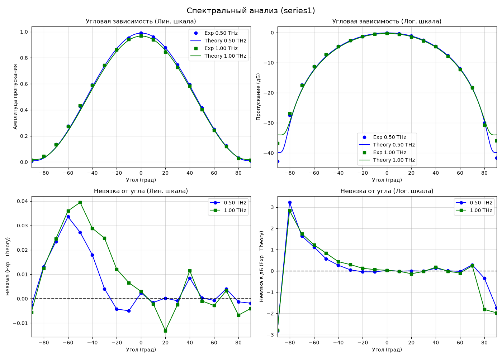
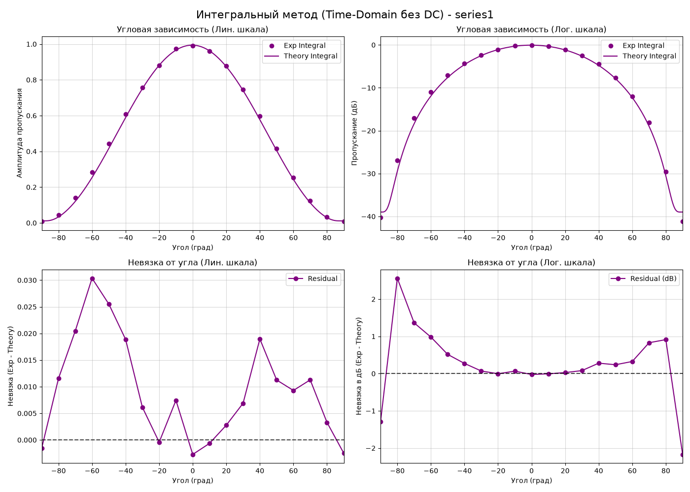
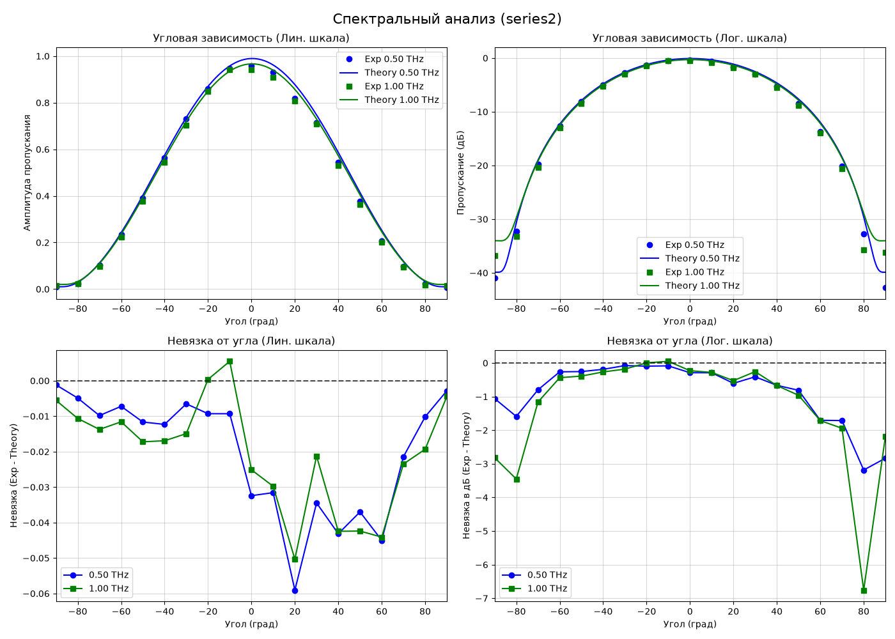
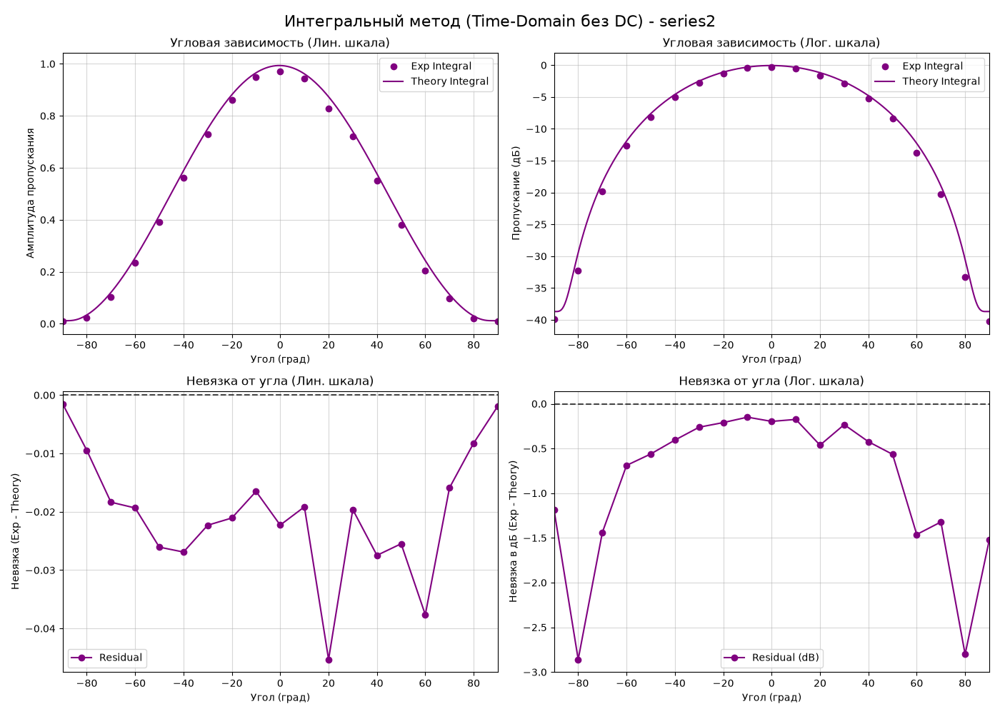
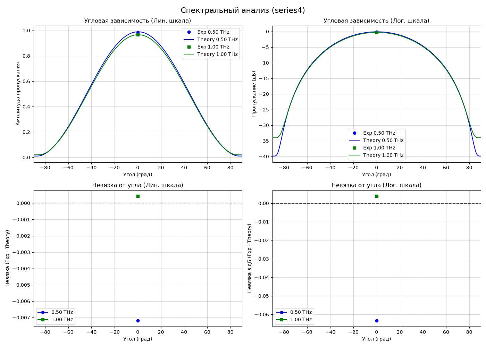
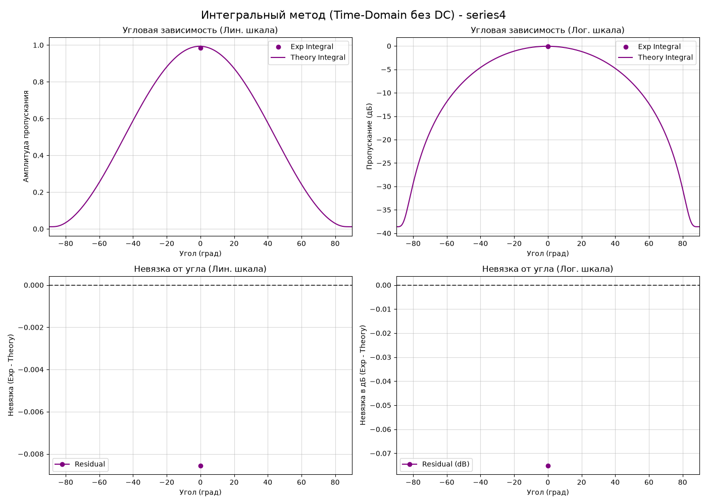
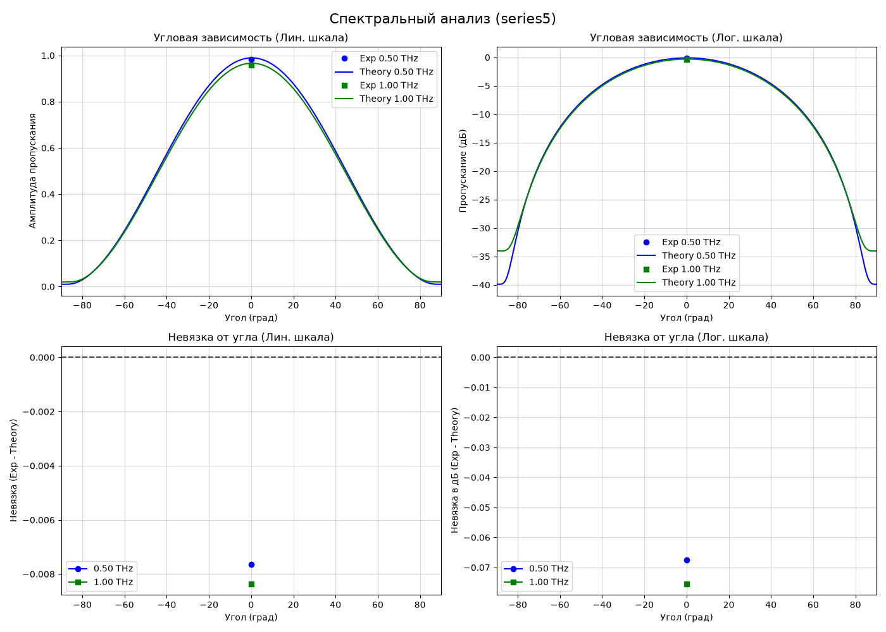
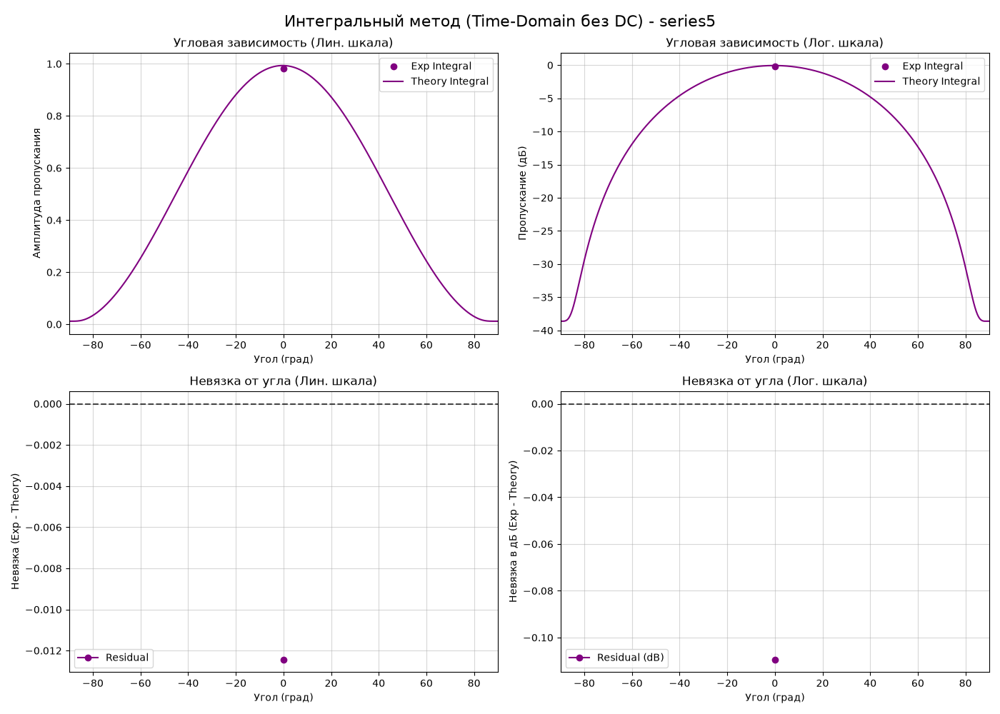

# Угловые зависимости и невязки: Спектральный и Интегральный методы

## Описание модели и используемые параметры

В данном отчете представлено сопоставление экспериментальных данных ТГц-TDS спектроскопии с теоретической электродинамической моделью Бланко для системы из двух проволочных поляризаторов (аттенюатора).

### Оптимизированные параметры решётки и тракта:
- **Период проволочной решётки ($P$):** 15.500 мкм
- **Диаметр проволоки ($D$):** 4.045 мкм
- **Систематический сдвиг угла ($\theta_{offset}$):** $0.35^\circ$
- **Коэффициент поглощения/рассеяния ($loss\_factor$):** 0.295 (степень $\gamma = 1.69$)
- **Фазовая задержка оптического пути ($\tau_{ps}$):** 0.029 пс

### Описание методов:
1. **Спектральный анализ:** Амплитудный коэффициент пропускания $T(\nu) = |E_s(\nu)| / |E_b(\nu)|$ оценивается на фиксированных частотах $0.5$ ТГц и $1.0$ ТГц.
2. **Интегральный метод (Time-Domain):** Амплитудное пропускание оценивается по полной энергии импульса после удаления DC-составляющей (смещения ноля): $T_{int} = \sqrt{\int E_s^2(t) dt / \int E_b^2(t) dt}$. Теоретическое значение вычисляется как RMS-усреднение спектральной модели по фоновому весовому спектру.

---

## 356att

### Спектральный анализ (0.5 и 1.0 ТГц)

### Интегральный метод (Time-Domain)

---

## series1

### Спектральный анализ (0.5 и 1.0 ТГц)

### Интегральный метод (Time-Domain)

---

## series2

### Спектральный анализ (0.5 и 1.0 ТГц)

### Интегральный метод (Time-Domain)

---

## series3

### Спектральный анализ (0.5 и 1.0 ТГц)

### Интегральный метод (Time-Domain)

---

## series4

### Спектральный анализ (0.5 и 1.0 ТГц)

### Интегральный метод (Time-Domain)

---

## series5

### Спектральный анализ (0.5 и 1.0 ТГц)

### Интегральный метод (Time-Domain)

---

