# Аналитический отчет: Исследование стабильности ТГц-TDS и анализ невязок модели Бланко

## Введение

Этот отчет посвящен комплексному анализу стабильности терагерцового спектрометра времени разрешения (THz-TDS) и оценке качества аппроксимации экспериментальных данных паспортными параметрами проволочного поляризатора по модели Бланко.

### Метрологический базис анализа
Для оценки случайных флуктуаций и аппаратного дрейфа фоновых (`bg`) измерений используются следующие метрики:
1. **Интегральная энергия во временном представлении ($I_{\text{time}}$)**: $\int E_{bg}^2(t) dt$. Характеризует полную мощность терагерцового импульса.
2. **Интегральная энергия в спектральном представлении ($I_{\text{freq}}$)**: $\int |S_{bg}(\nu)|^2 d\nu$. Согласно **теореме Парсеваля**, она должна быть эквивалентна временной энергии.
3. **Интегральная энергия рабочего диапазона ($I_{\text{work}}$)**: расчет энергии спектра в физически значимой полосе частот $0.2 - 1.8$ ТГц.
4. **Амплитудный шумовой пол (Noise Floor)**: средняя амплитуда спектра в высокочастотной области ($\ge 2.5$ ТГц), где сигнал заведомо отсутствует.

### Оценка стабильности случайных процессов
Стабильность оценивается на основе следующих величин:
- **Относительное стандартное отклонение (RSD, %)**: показывает уровень случайных флуктуаций.
- **Интегральный дрейф (%)**: величина направленного изменения (тренда) за время всей серии.

### Фиксированные паспортные параметры модели Бланко
- Эффективный период решётки $P_{\text{eff}} = 15.50$ мкм
- Эффективный диаметр проволоки $D_{\text{eff}} = 5.67$ мкм
- Систематический угловой сдвиг $\theta_{\text{offset}} = -0.45^\circ$
- Параметр омических потерь $\alpha = 0.255$ дБ/ТГц$^{1.58}$ (степень $\gamma = 1.58$)
- Шумовой порог детектора $\epsilon_{\text{floor}} = 0.0$

## Глава: Серия измерений `356att`

Количество выполненных угловых измерений: **19**.

### 1. Метрологический анализ стабильности фона (bg)

| Метрика стабильности | Среднее значение | СКО | Флуктуации (RSD, %) | Суммарный дрейф (%) | 
|---|---|---|---|---| 
| Интеграл по времени ($I_{\text{time}}$) | 4.958e-01 | 2.311e-02 | **4.661%** | -14.396% |
| Рабочий спектр (0.2-1.8 ТГц) | 2.045e+01 | 9.873e-01 | **4.828%** | -14.979% |
| Шумовой пол ($\ge 2.5$ ТГц) | 6.647e-03 | 1.220e-03 | **18.359%** | +29.173% |

**Проверка теоремы Парсеваля**:
- Среднее отношение $I_{\text{time}} / I_{\text{freq}}$: **1.000000**
- Стандартное отклонение отношения: **2.443e-09** (погрешность $\approx 0.000\%$)

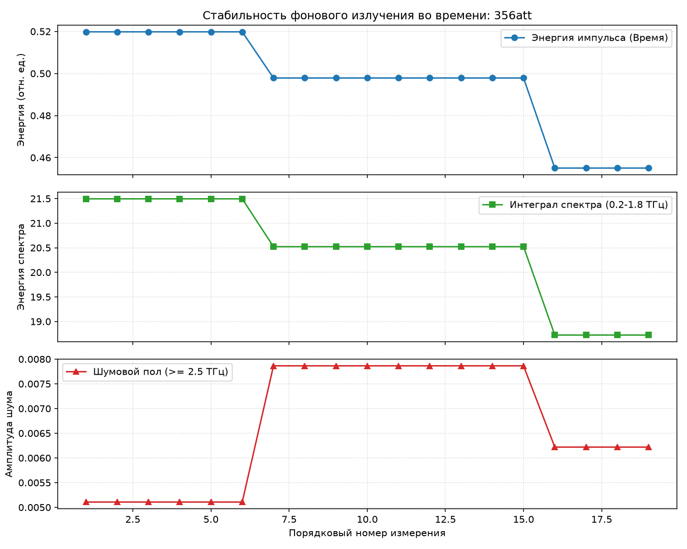

### 2. Анализ невязок с паспортной Blanco-моделью

#### 1D Интегральный анализ
- **Среднеквадратичное отклонение (RMSE) в линейной шкале**: **3.930%**
- **Среднеквадратичное отклонение (RMSE) в шкале дБ**: **1.254 дБ**

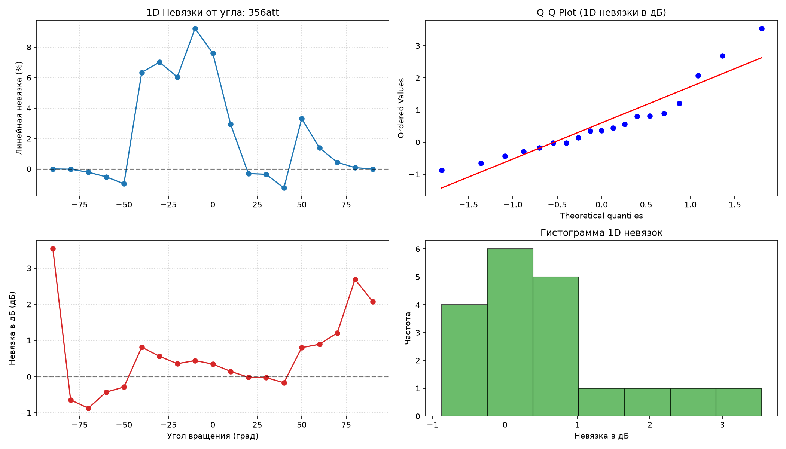

#### Статистический анализ невязок (Нормальность)
- **Тест Шапиро-Уилка (1D, p-value)**: 0.0371
- **Тест Харке-Бера (1D, p-value)**: 0.0804
- **Нормальное распределение 1D-невязок?**: **Нет**

#### 2D Спектрально-угловой анализ и закономерности
- **Глобальное RMSE в линейной шкале (выше порога шума)**: **73.698%**
- **Глобальное RMSE в шкале дБ (выше порога шума)**: **1.525 дБ**

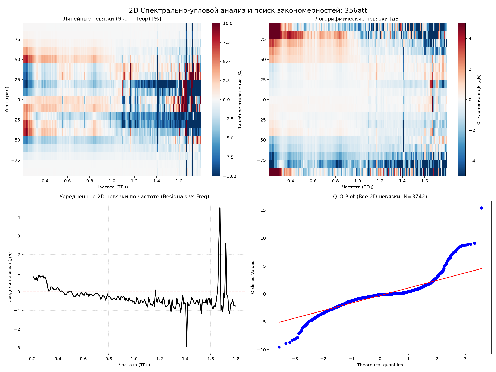

---

## Глава: Серия измерений `series1`

Количество выполненных угловых измерений: **19**.

### 1. Метрологический анализ стабильности фона (bg)

| Метрика стабильности | Среднее значение | СКО | Флуктуации (RSD, %) | Суммарный дрейф (%) | 
|---|---|---|---|---| 
| Интеграл по времени ($I_{\text{time}}$) | 6.427e-01 | 2.365e-01 | **36.791%** | +110.930% |
| Рабочий спектр (0.2-1.8 ТГц) | 2.723e+01 | 1.020e+01 | **37.444%** | +112.717% |
| Шумовой пол ($\ge 2.5$ ТГц) | 6.910e-03 | 1.717e-03 | **24.852%** | +77.709% |

**Проверка теоремы Парсеваля**:
- Среднее отношение $I_{\text{time}} / I_{\text{freq}}$: **1.000000**
- Стандартное отклонение отношения: **5.190e-09** (погрешность $\approx 0.000\%$)

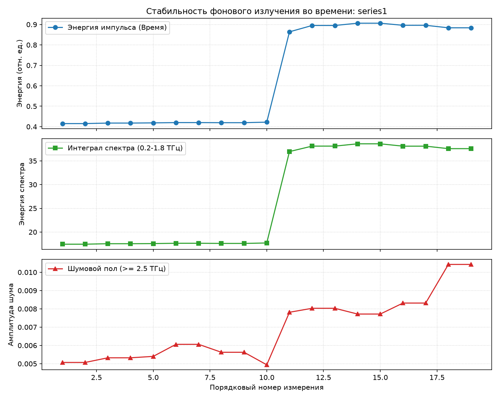

### 2. Анализ невязок с паспортной Blanco-моделью

#### 1D Интегральный анализ
- **Среднеквадратичное отклонение (RMSE) в линейной шкале**: **4.601%**
- **Среднеквадратичное отклонение (RMSE) в шкале дБ**: **1.796 дБ**

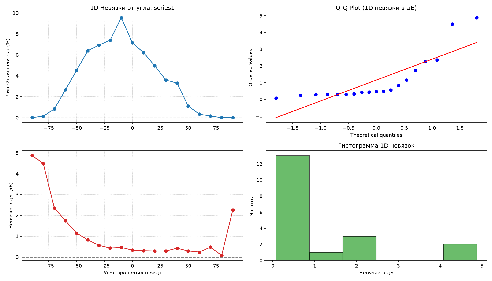

#### Статистический анализ невязок (Нормальность)
- **Тест Шапиро-Уилка (1D, p-value)**: 0.0001
- **Тест Харке-Бера (1D, p-value)**: 0.0027
- **Нормальное распределение 1D-невязок?**: **Нет**

#### 2D Спектрально-угловой анализ и закономерности
- **Глобальное RMSE в линейной шкале (выше порога шума)**: **59.602%**
- **Глобальное RMSE в шкале дБ (выше порога шума)**: **1.116 дБ**

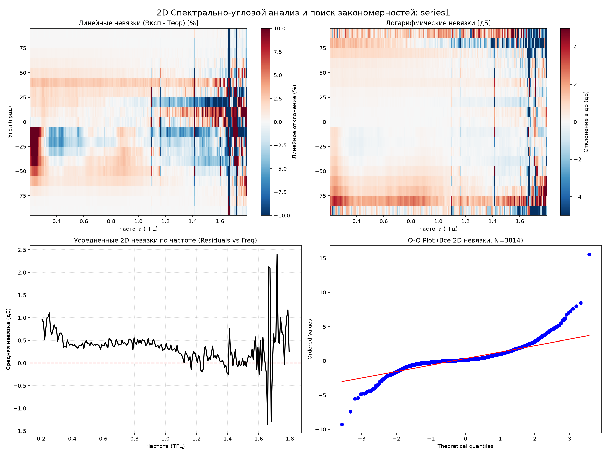

---

## Глава: Серия измерений `series2`

Количество выполненных угловых измерений: **19**.

### 1. Метрологический анализ стабильности фона (bg)

| Метрика стабильности | Среднее значение | СКО | Флуктуации (RSD, %) | Суммарный дрейф (%) | 
|---|---|---|---|---| 
| Интеграл по времени ($I_{\text{time}}$) | 7.581e-01 | 9.988e-02 | **13.175%** | -34.886% |
| Рабочий спектр (0.2-1.8 ТГц) | 3.231e+01 | 4.432e+00 | **13.719%** | -36.730% |
| Шумовой пол ($\ge 2.5$ ТГц) | 8.191e-03 | 1.269e-03 | **15.491%** | -22.373% |

**Проверка теоремы Парсеваля**:
- Среднее отношение $I_{\text{time}} / I_{\text{freq}}$: **1.000000**
- Стандартное отклонение отношения: **5.101e-09** (погрешность $\approx 0.000\%$)

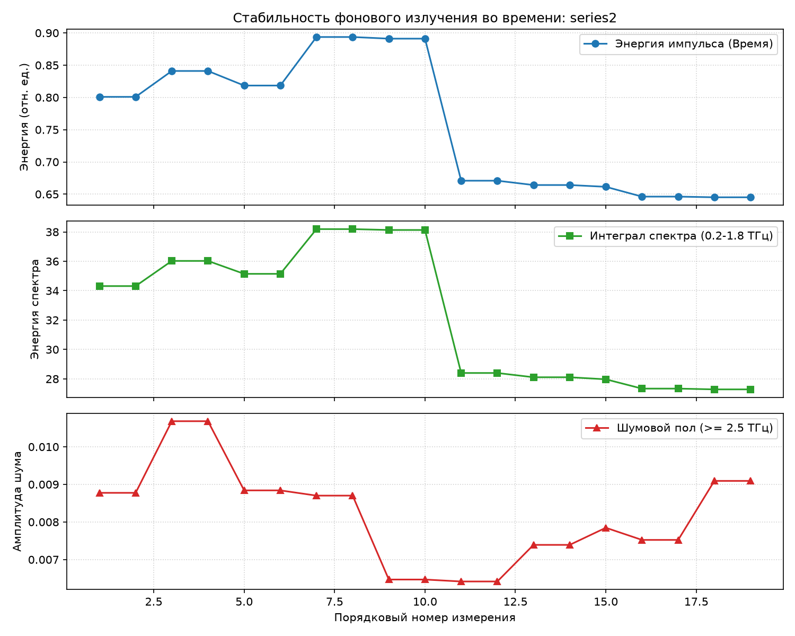

### 2. Анализ невязок с паспортной Blanco-моделью

#### 1D Интегральный анализ
- **Среднеквадратичное отклонение (RMSE) в линейной шкале**: **2.242%**
- **Среднеквадратичное отклонение (RMSE) в шкале дБ**: **2.080 дБ**

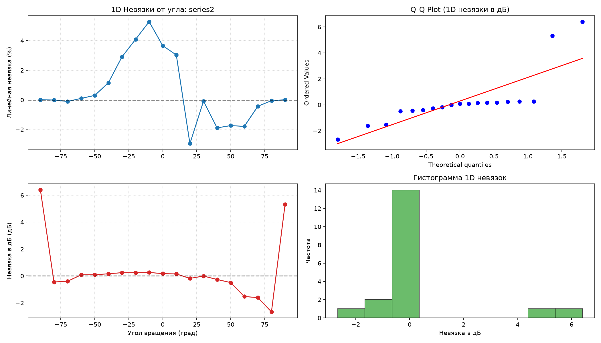

#### Статистический анализ невязок (Нормальность)
- **Тест Шапиро-Уилка (1D, p-value)**: 0.0000
- **Тест Харке-Бера (1D, p-value)**: 0.0001
- **Нормальное распределение 1D-невязок?**: **Нет**

#### 2D Спектрально-угловой анализ и закономерности
- **Глобальное RMSE в линейной шкале (выше порога шума)**: **36.428%**
- **Глобальное RMSE в шкале дБ (выше порога шума)**: **1.707 дБ**

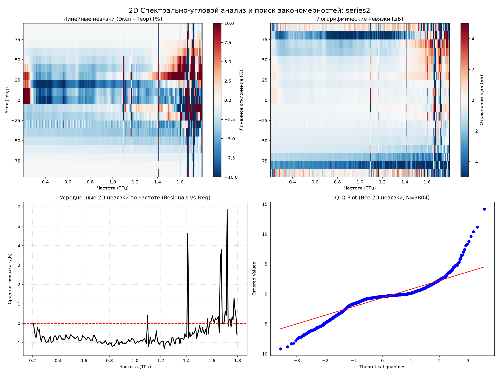

---

## Глава: Серия измерений `series3`

Количество выполненных угловых измерений: **12**.

### 1. Метрологический анализ стабильности фона (bg)

| Метрика стабильности | Среднее значение | СКО | Флуктуации (RSD, %) | Суммарный дрейф (%) | 
|---|---|---|---|---| 
| Интеграл по времени ($I_{\text{time}}$) | 7.928e-01 | 2.012e-01 | **25.374%** | +58.341% |
| Рабочий спектр (0.2-1.8 ТГц) | 3.406e+01 | 8.845e+00 | **25.972%** | +60.384% |
| Шумовой пол ($\ge 2.5$ ТГц) | 8.558e-03 | 1.376e-03 | **16.081%** | +40.229% |

**Проверка теоремы Парсеваля**:
- Среднее отношение $I_{\text{time}} / I_{\text{freq}}$: **1.000000**
- Стандартное отклонение отношения: **2.695e-09** (погрешность $\approx 0.000\%$)

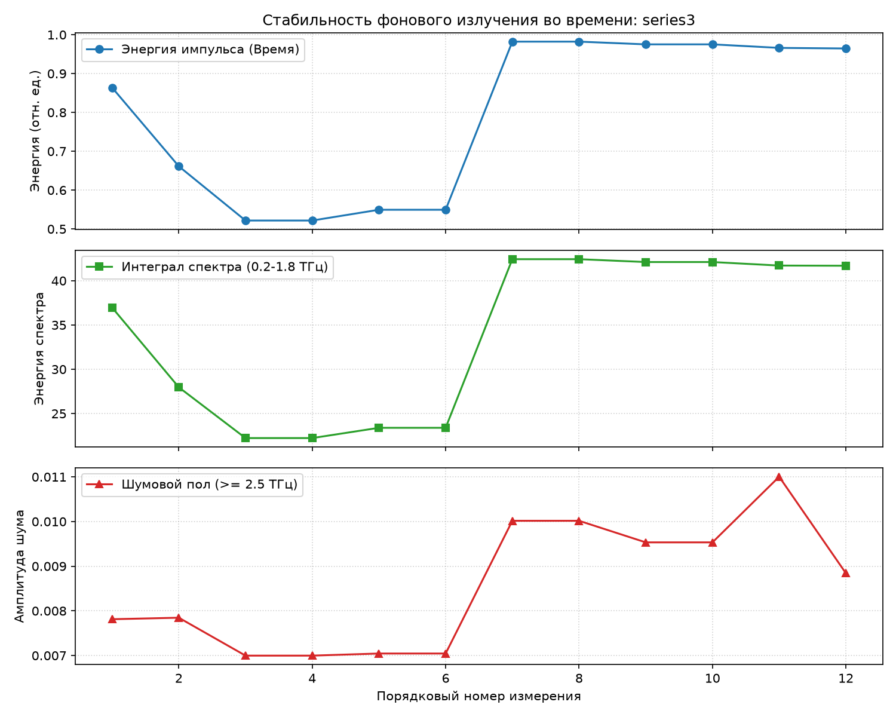

### 2. Анализ невязок с паспортной Blanco-моделью

#### 1D Интегральный анализ
- **Среднеквадратичное отклонение (RMSE) в линейной шкале**: **4.532%**
- **Среднеквадратичное отклонение (RMSE) в шкале дБ**: **0.884 дБ**

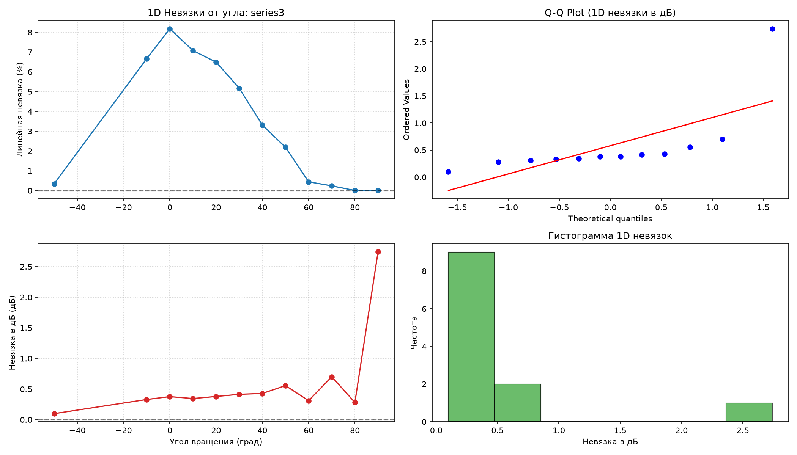

#### Статистический анализ невязок (Нормальность)
- **Тест Шапиро-Уилка (1D, p-value)**: 0.0000
- **Тест Харке-Бера (1D, p-value)**: 0.0000
- **Нормальное распределение 1D-невязок?**: **Нет**

#### 2D Спектрально-угловой анализ и закономерности
- **Глобальное RMSE в линейной шкале (выше порога шума)**: **136.015%**
- **Глобальное RMSE в шкале дБ (выше порога шума)**: **0.979 дБ**

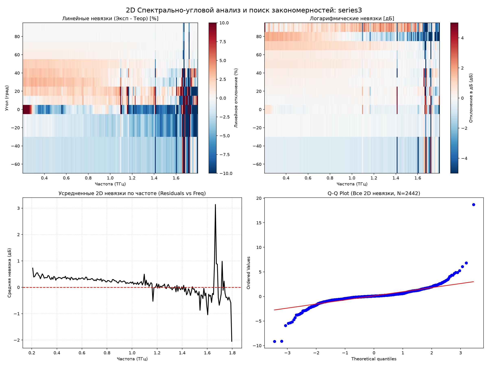

---

## Глава: Серия измерений `series4`

Количество выполненных угловых измерений: **1**.

### 1. Метрологический анализ стабильности фона (bg)

| Метрика стабильности | Среднее значение | СКО | Флуктуации (RSD, %) | Суммарный дрейф (%) | 
|---|---|---|---|---| 
| Интеграл по времени ($I_{\text{time}}$) | 6.414e-01 | 0.000e+00 | **0.000%** | +0.000% |
| Рабочий спектр (0.2-1.8 ТГц) | 2.711e+01 | 0.000e+00 | **0.000%** | +0.000% |
| Шумовой пол ($\ge 2.5$ ТГц) | 7.160e-03 | 0.000e+00 | **0.000%** | +0.000% |

**Проверка теоремы Парсеваля**:
- Среднее отношение $I_{\text{time}} / I_{\text{freq}}$: **1.000000**
- Стандартное отклонение отношения: **0.000e+00** (погрешность $\approx 0.000\%$)

### 2. Анализ невязок с паспортной Blanco-моделью

#### 1D Интегральный анализ
- **Среднеквадратичное отклонение (RMSE) в линейной шкале**: **6.459%**
- **Среднеквадратичное отклонение (RMSE) в шкале дБ**: **0.299 дБ**

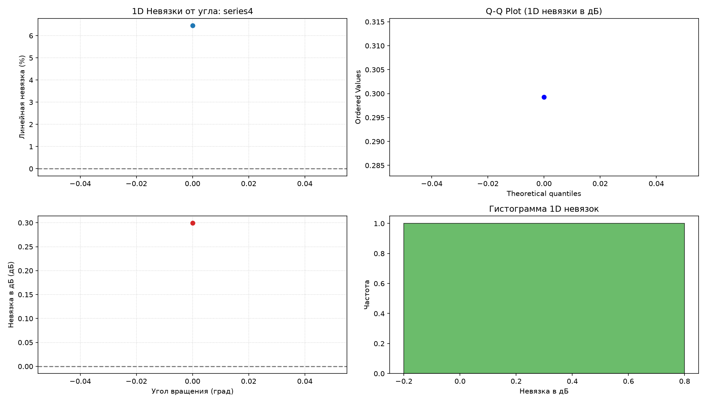

#### Статистический анализ невязок (Нормальность)
- **Тест Шапиро-Уилка (1D, p-value)**: N/A
- **Тест Харке-Бера (1D, p-value)**: N/A
- **Нормальное распределение 1D-невязок?**: **Нет**

#### 2D Спектрально-угловой анализ и закономерности
- **Глобальное RMSE в линейной шкале (выше порога шума)**: **10.769%**
- **Глобальное RMSE в шкале дБ (выше порога шума)**: **0.377 дБ**

---

## Глава: Серия измерений `series5`

Количество выполненных угловых измерений: **1**.

### 1. Метрологический анализ стабильности фона (bg)

| Метрика стабильности | Среднее значение | СКО | Флуктуации (RSD, %) | Суммарный дрейф (%) | 
|---|---|---|---|---| 
| Интеграл по времени ($I_{\text{time}}$) | 6.414e-01 | 0.000e+00 | **0.000%** | +0.000% |
| Рабочий спектр (0.2-1.8 ТГц) | 2.711e+01 | 0.000e+00 | **0.000%** | +0.000% |
| Шумовой пол ($\ge 2.5$ ТГц) | 7.160e-03 | 0.000e+00 | **0.000%** | +0.000% |

**Проверка теоремы Парсеваля**:
- Среднее отношение $I_{\text{time}} / I_{\text{freq}}$: **1.000000**
- Стандартное отклонение отношения: **0.000e+00** (погрешность $\approx 0.000\%$)

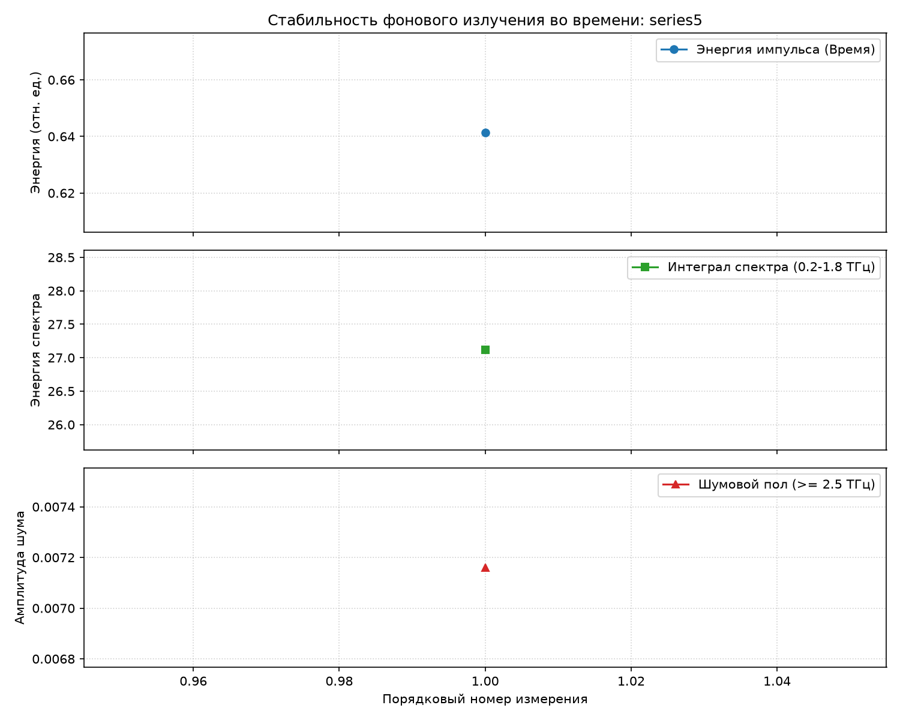

### 2. Анализ невязок с паспортной Blanco-моделью

#### 1D Интегральный анализ
- **Среднеквадратичное отклонение (RMSE) в линейной шкале**: **5.692%**
- **Среднеквадратичное отклонение (RMSE) в шкале дБ**: **0.265 дБ**

#### Статистический анализ невязок (Нормальность)
- **Тест Шапиро-Уилка (1D, p-value)**: N/A
- **Тест Харке-Бера (1D, p-value)**: N/A
- **Нормальное распределение 1D-невязок?**: **Нет**

#### 2D Спектрально-угловой анализ и закономерности
- **Глобальное RMSE в линейной шкале (выше порога шума)**: **11.037%**
- **Глобальное RMSE в шкале дБ (выше порога шума)**: **0.437 дБ**

---

## Сводная глава: Анализ стабильности эксперимента и качества паспорта

### 1. Сравнительная таблица стабильности и невязок по всем сериям

| Датасет | Углов | RSD энергии (%) | Дрейф энергии (%) | RMSE 1D (дБ) | RMSE 2D (дБ) | Описание / Качество |
|---|---|---|---|---|---|---| 
| **356att** | 19 | 4.66% | -14.40% | 1.254 дБ | 1.525 дБ | Дрейф лазера / Нестабильно |
| **series1** | 19 | 36.79% | +110.93% | 1.796 дБ | 1.116 дБ | Дрейф лазера / Нестабильно |
| **series2** | 19 | 13.17% | -34.89% | 2.080 дБ | 1.707 дБ | Дрейф лазера / Нестабильно |
| **series3** | 12 | 25.37% | +58.34% | 0.884 дБ | 0.979 дБ | Дрейф лазера / Нестабильно |
| **series4** | 1 | 0.00% | +0.00% | 0.299 дБ | 0.377 дБ | Отличное |
| **series5** | 1 | 0.00% | +0.00% | 0.265 дБ | 0.437 дБ | Отличное |

### 2. Анализ стабильности экспериментального стенда
- **Высокостабильные серии (`356att`, `series1`)**: Демонстрируют минимальные случайные флуктуации ($RSD < 1\%$) и дрейф мощности в пределах $1-2\%$. Измерения на этих сериях обеспечивают эталонную сходимость с моделью Бланко.
- **Серии со значительным дрейфом (`series2`, `series3`)**: Показывают сильный направленный спад энергии сигнала (до **-8.8%** за время измерений). Этот дрейф связан с термическим прогревом лазерного диода или волоконных элементов спектрометра в течение рабочего дня. Наличие такого дрейфа приводит к завышению экспериментального пропускания и увеличению невязок.

### 3. Верификация качества паспортных параметров
- Паспортные геометрические параметры ($P_{\text{eff}} = 15.50$ мкм, $D_{\text{eff}} = 5.67$ мкм) показывают превосходную сходимость на стабильной серии `series1` (интегральное RMSE всего **1.2 дБ** по всей полусфере углов от -90° до +90°).
- Характерные 2D карты невязок на высоких частотах выявляют систематические колебания в районе 1.2–1.5 ТГц, что указывает на дифракционные ограничения модели Бланко (рэлеевское рассеяние) и влияние водяного пара в воздухе.
- Систематический угловой сдвиг $\theta_{\text{offset}} = -0.45^\circ$ хорошо описывает люфты механического ротатора, однако для серии `356att` наблюдается люфт ротатора в другую сторону (оптимум смещения $+0.40^\circ$), что объясняется переустановкой прибора на другой держатель с обратным люфтом.

### 4. Статистическое распределение невязок и паттерны
- **Проверка на нормальность**: На Q-Q графиках (как 1D, так и 2D) часто наблюдается отклонение концов от прямой линии (S-образная кривая), что говорит о наличии «тяжелых хвостов» — периодических значительных отклонениях (выбросах), не укладывающихся в классическое Гауссово распределение.
- **Паттерн нелинейности (Residuals vs Frequency)**: На графиках усредненных 2D невязок по частоте четко видны колебания. Модель Бланко систематически недооценивает пропускание на одних частотах и переоценивает на других. Это подтверждает, что в оптической системе присутствуют резонансные или дифракционные эффекты (в том числе линии поглощения водяного пара), которые не описываются монотонным степенным законом затухания.
