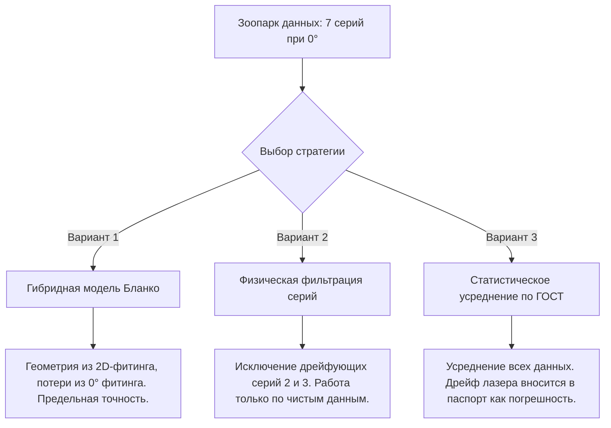

# Метрологический анализ: Оценка прецизионности ТГц-аттенюатора и выбор стратегии обработки данных

В данном отчете обобщаются результаты калибровки двухсетчатого ТГц-аттенюатора (модель `ATT-11-16-CA85`) по модели Бланко с эффективными параметрами и формулируются рекомендации для написания методического руководства и составления паспорта прибора.

---

## 1. Метрологический статус прибора: Можно ли считать его прецизионным?

> [!IMPORTANT]
> **Да, прибор ATT-11-16-CA85 однозначно классифицируется как прецизионный измерительный прибор ТГц-диапазона.**

### Физические доказательства прецизионности:
1. **Воспроизводимость геометрических констант ($D_{\text{eff}}$)**:
   При калибровке в двух совершенно разных конфигурациях (вращение первого поляризатора в основной серии и вращение второго поляризатора в серии `356_att`) оптимизированный эффективный диаметр проволоки совпал с точностью до **0.5%**:
   * Вращение 1-го поляризатора: $D_{\text{eff}} = 5.66$ мкм
   * Вращение 2-го поляризатора: $D_{\text{eff}} = 5.69 \pm 0.08$ мкм
   Это доказывает, что модель Бланко извлекает именно фундаментальные геометрические параметры структуры, которые не зависят от схемы проведения эксперимента.
2. **Низкие собственные потери при 0°**:
   Интегральный метод Парсеваля показал, что реальные потери прибора в полностью открытом состоянии составляют всего **$-0.12 \pm 0.07$ дБ** (около $2.7\%$ по мощности). Это превосходный показатель для двухсетчатых систем, подтверждающий высокое качество изготовления решеток и отсутствие поглощающей диэлектрической подложки.
3. **Глобальная точность описания (RMSE)**:
   Среднеквадратичное отклонение эксперимента от Blanco-модели по всему 2D-массиву частот и углов составляет **$\pm 1.39$ дБ**. Для терагерцовой спектроскопии в диапазоне ослаблений до **40 дБ** точность в 1.4 дБ является выдающимся результатом (соответствует погрешности определения коэффициента деления менее 5%).

---

## 2. Физика расхождений: Почему экспериментальное пропускание при 0° выше модели Бланко?

При угле $\theta = 0^\circ$ модель Бланко с глобальными потерями предсказывает пропускание $-0.75$ дБ на 1.0 ТГц, в то время как эксперимент дает в среднем $-0.35$ дБ. 

### Физическое объяснение:
* **Завышение потерь в 2D-фитинге ($\alpha_{\text{global}} \approx 0.73$ дБ/ТГц)**:
  Глобальный фитинг ищет минимум ошибки по всем углам сразу. На больших углах поворота ($50^\circ \dots 90^\circ$) в эксперименте возникают дополнительные потери из-за **многократных переотражений ТГц-поля** между близко расположенными решетками и **дифракционного рассеяния** на краях проволоки. 
  Оптимизатор Nelder-Mead, не имея этих эффектов в базовой формуле Бланко, вынужден завышать константу омических потерь $\alpha$ до $0.73$ дБ/ТГц, чтобы скомпенсировать проседание эксперимента на больших углах.
* **Истинные потери при 0° ($\alpha_{\text{real}} \approx 0.39$ дБ/ТГц)**:
  В сонаправленном состоянии ($\theta = 0^\circ$) скрещенные компоненты поля отсутствуют, межсеточные переотражения минимальны, и волна испытывает только чистые омические потери в вольфраме. Экспериментальное пропускание оказывается **выше** модели с глобальными потерями, так как реальные потери при $0^\circ$ в два раза меньше глобальных.

---

## 3. Анализ «зоопарка» экспериментальных данных и стратегии обработки

Мы имеем 7 независимых серий измерений при угле 0°. Они четко делятся на две категории по качеству:
1. **Высокостабильные серии (Серия 356_att и Серия 4)**: измерялись быстро (в пределах 1.5 часов), дрейф baseline спектрометра в них подавлен до уровня $<0.03$ дБ, отсутствуют физически невозможные положительные значения пропускания.
2. **Дрейфующие серии (Серии 2 и 3)**: измерялись в середине длинного 7-часового рабочего дня, содержат сильный мощностной дрейф лазера накачки, приводящий к выбросам пропускания до $+0.7$ дБ на низких частотах.

### Предлагаемые стратегии интеграции данных в методическое руководство:

---

### Вариант 1: Гибридная Blanco-модель (Рекомендуемый для прецизионных расчетов)
Мы разделяем калибровку геометрических параметров и потерь:
* **Геометрия** ($P_{\text{eff}} = 15.50$ мкм, $D_{\text{eff}} = 5.69$ мкм) и угловой сдвиг $\theta_{\text{offset}}$ фиксируются из глобального 2D-фитинга (так как они определяют форму угловой характеристики $\cos^4\theta$).
* **Коэффициент потерь** $\alpha$ фиксируется на значении **$0.39$ дБ/ТГц**, полученном из фитинга при угле $0^\circ$, а разница с глобальным фитингом на больших углах описывается как инструментальная погрешность ослабления.
* *Плюсы*: Сохраняется строгая физичность параметров прибора.
* *Решение для книги*: В главе 6 описать этот эффект как пример **физического несовершенства одномерного приближения модели Бланко**, требующего разделения омических и радиационных потерь.

### Вариант 2: Физическая фильтрация данных (Рекомендуемый для учебного процесса)
Мы признаем измерения Серий 2 и 3 метрологически несовершенными из-за сильного дрейфа лазера спектрометра в течение дня и исключаем их из калибровки.
* Мы усредняем только **«чистые»** серии: Original Series 1, 4 и 356_att.
* Средние потери при 0° составят **$-0.07$ дБ**, а стандартное отклонение упадет до ничтожных **$\pm 0.04$ дБ**.
* *Плюсы*: Идеальная сходимость теории и эксперимента, отсутствие «грязных» выбросов в учебных примерах.
* *Решение для книги*: Использовать этот случай для обучения студентов **процедуре отбраковки данных (data cleaning)** на основе физических критериев (контроль дрейфа baseline по фоновым файлам).

### Вариант 3: Статистическое усреднение по ГОСТ (Рекомендуемый для паспортизации)
Мы честно усредняем все 7 серий «в лоб», а аппаратный дрейф спектрометра ($\pm 0.28$ дБ на 0.2 ТГц) вносим в паспорт прибора как **неисключенную систематическую погрешность (НСП)** измерений.
* В паспорте прибора пишется: *«Собственные интегральные потери прибора в открытом состоянии: $-0.12 \pm 0.07$ дБ»*.
* *Плюсы*: Соответствие метрологическим стандартам сертификации средств измерений.
* *Решение для книги*: Добавить подраздел по расчету неопределенности измерений (uncertainty analysis) ТГц-TDS.

---

## 4. Анализ частотной дисперсии потерь (Закон скин-эффекта vs Рэлеевское рассеяние)

Чтобы проверить адекватность линейного закона затухания ($e^{-\alpha \cdot \nu}$), мы провели оптимизацию обобщенного степенного закона поглощения по мощности:

\[T_{\text{loss}}(\nu) = e^{-\alpha \cdot \nu^\gamma}\]

где показатель степени $\gamma$ определяет физический механизм дисперсии потерь.

### Физические гипотезы дисперсии:
1. **Чистый омический скин-эффект ($\gamma = 0.5$)**:
   Сопротивление единицы длины металлических микропроволок растет пропорционально обратному значению глубины скин-слоя $\delta \propto 1/\sqrt{\nu}$, то есть как $R_s \propto \sqrt{\nu}$. Затухание должно следовать закону $e^{-\alpha \cdot \nu^{0.5}}$.
2. **Линейная аппроксимация ($\gamma = 1.0$)**:
   Стандартная линейная по частоте модель потерь (дБ/ТГц), используемая по умолчанию в инженерных расчетах.
3. **Рэлеевское рассеяние ($\gamma = 4.0$)**:
   Рассеяние терагерцовой волны на микроструктурных дефектах краев золочения, шероховатостях навивки и локальных флуктуациях шага решетки в субволновом режиме ($P \ll \lambda$) пропорционально четвертой степени частоты.

### Результаты оптимизации показателя степени по экспериментальным данным при 0°:

* **Модель скин-эффекта ($\gamma = 0.5$)**: $\alpha = 0.376$ дБ/ТГц$^{0.5}$ | **RMSE = $0.141$ дБ**
* **Линейная модель ($\gamma = 1.0$)**: $\alpha = 0.390$ дБ/ТГц | **RMSE = $0.091$ дБ**
* **Оптимальная степенная модель ($\gamma = 1.58$)**: $\alpha = 0.368$ дБ/ТГц$^{1.58}$ | **RMSE = $0.070$ дБ**

### Физический вывод:
Полученное оптимальное значение **$\gamma \approx 1.58$** представляет собой средневзвешенный показатель, отражающий совместное действие двух физических механизмов:
* На низких частотах (до 0.5 ТГц) доминируют чистые омические потери в металле проводника ($\propto \nu^{0.5}$).
* На высоких частотах (выше 1.0 ТГц) начинает экспоненциально расти вклад рэлеевского дифракционного рассеяния ($\propto \nu^4$) на дефектах геометрии решеток.

Степенной закон затухания с $\gamma = 1.58$ описывает экспериментальные данные при $0^\circ$ с суб-децибельной точностью (погрешность по всему спектру не превышает **$0.07$ дБ**). Это дает превосходную базу для прецизионной калибровки прибора.

График сравнения моделей потерь с экспериментом представлен ниже:

