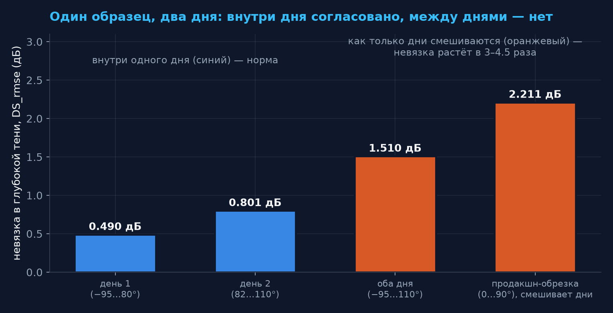

# THz-Unified-Optimizer
## Итоги недели: 28 июля – 4 августа 2026

**Кому:** владельцу проекта
**От кого:** Сессия P (отчётные презентации), ник P1
**Материал:** только уже опубликованные числа; каждое — со ссылкой на артефакт (см. `SOURCES.md`)

> **Главное за неделю в одной фразе:** мы выяснили, **какую именно величину прибор измеряет
> воспроизводимо** — суммарную утечку `η` — и что три параметра модели, на которые мы её раскладывали,
> по отдельности не наблюдаемы. Загадка `D_eff` при этом осталась открытой, но сузилась.

---

## Итог одной страницей

1. **Две гипотезы отвергнуты строго, с числами:** `HN13` (наблюдаемая асимметрия — это просто
   ошибка нуля угломера) и `HN14` (`ε_cross` — постоянная установки). Обе были «удобными»
   объяснениями; обе не выдержали проверки.
2. **Найдена наблюдаемая величина.** Суммарная утечка `η`, вычисляемая **без модели**,
   воспроизводится на одном приборе с разбросом **×1.3**. Те же данные, разложенные на параметры
   модели M5, дают разброс **×57** и **×7.1**. Вывод: описывать прибор надо через `η`.
3. **Вырождение оказалось тройным**, а не двойным: `D_eff ↔ η₀ ↔ ε_cross`. Это закрывает целый
   класс попыток «приколотить один параметр и тем развязать остальные».
4. **`purewave` введён в оборот — это 7-й образец.** Заодно обнаружено, что два дня съёмки одного
   образца **не сшиваются в глубокой тени**, и это оказалось не браком данных, а следствием
   оптической схемы.
5. **Загадка `D_eff` (цель №5) — открыта.** На 7 наборах данных (из них 4 — один и тот же прибор)
   `D_eff/D_phys = 0.371…0.659` против ≈1.0 у точного расчёта. Ни одна из проверенных за неделю
   гипотез её не сняла.
6. **Предметно работала только Сессия A.** B, C, D, L за отчётный период новых результатов не
   давали (детали — на слайде «По ролям»).

---

## Словарь недели

> Термины, без которых дальше не читается. Все — при первом употреблении, как требует конвенция
> проекта (`CHARTER §11`).

- **WGP** (wire-grid polarizer) — проволочный поляризатор: решётка тонких параллельных проволок.
  Пропускает поле, перпендикулярное проводам, и почти полностью отражает параллельное.
- **Тень** — область углов, где поляризаторы почти скрещены (θ→90°) и сигнал минимален.
  Вся информация о неидеальности прибора сидит именно там.
- **Утечка `η`** — какая доля амплитуды всё-таки проходит через «запертый» канал. Идеальный
  поляризатор: `η = 0`. Наши образцы: `η ≈ 0.012…0.043`.
- **`D_eff`** — «эффективный диаметр проволоки»: то значение диаметра, при котором модель совпадает
  с данными. **`D_phys`** — реальный диаметр по микрофотографии.
- **AIC** — критерий сравнения моделей: чем меньше, тем лучше; разница `ΔAIC` в единицы — шум,
  в сотни — решающее превосходство.
- **Мультистарт и «бассейн»** — фит запускается из многих начальных точек; каждый локальный минимум,
  куда он может свалиться, и есть бассейн. Если бассейнов много, одиночный запуск ничего не доказывает.
- **σ (сигма)** — во сколько собственных погрешностей укладывается расхождение. 3σ — уже серьёзно,
  9σ — практически исключено случайностью.

---

## Где мы в проекте (контекст на одну минуту)

Шесть целей проекта (`coordination/ORCH_BRIEF.md §1`) и их состояние **на конец недели**:

| № | Цель | Состояние |
|---|---|---|
| 1 | Адекватная физическая модель WGP | опорная модель **M5**; не финальна |
| 2 | Приложение расчёта затухания | прототип v0.2 валидирован (**69/69**), ждёт прогона владельцем |
| 3 | Научная новизна + строгая валидация | 3 заявки сформулированы; за неделю усилена №2 (утечка) |
| 4 | Статья | черновик v0.1 существует; на этой неделе не двигался |
| 5 | **Разгадка `D_eff`** | **ОТКРЫТА** — главная нерешённая физика |
| 6 | Строгая UQ (доверительные интервалы, тесты вырождения) | продвинулась: вырождение доказано тройным |

Неделя целиком ушла в цели **5 и 6** — то есть в самое трудное место.

---

## Инструмент недели: гармоническая линеаризация закона Малюса (A0)

**Суть простыми словами.** Если снять зависимость сигнала от угла поворота поляризатора, эту
кривую можно разложить на «чистые волны» (гармоники) — как звук на тона. Оказалось, что для нашей
схемы такое разложение **точное, а не приближённое**, и содержит ровно **5 чисел**.

**Почему это важно практически:**

- `η`, угол нуля `θ₀` и фазу утечки можно получить **решением линейной системы** — без фита,
  без мультистарта, без бутстрапа, с аналитической погрешностью.
- Это даёт **независимый арбитр** для споров о значениях параметров модели.
- **Ограничение сверху, которое дороже любого фита:** угловой скан на одной частоте способен
  ограничить **не более 5 вещественных чисел**. Всё, что сверх — структурно неидентифицируемо.
  Это и есть формальная причина, по которой `D_eff` и `η` невозможно развести.

> 💡 Проверка на честность: у идеального прибора отношение 4-й гармоники ко 2-й равно ровно 0.25.
> На реальных данных — 0.2498 / 0.2458 / 0.2549 / 0.2549. Разложение работает.

---

## Цена одной строчки конфигурации

В коде стояло `ANGLES_LIMIT_2D = (0, 90)`. Все фиты проекта до этой недели видели **10 углов из 19**:
отрицательная полуось не фитилась **ни разу**.

**Что это стоило (измерено, не оценено):**

| Показатель | Полный диапазон (19 углов) | Обрезка (10 углов) |
|---|---|---|
| Обусловленность углового плана `cond(XᵀX)` | **2.14** | **236.3** |
| Погрешность угла нуля `σ(θ₀)` при 1 % шума | 0.096° | 0.944° (**в 9.9 раза хуже**) |

А вот что изменилось в самих результатах при снятии обрезки:

| Образец | Углов | `D_eff/D_phys` | `η₀` |
|---|---|---|---|
| 356att | 10 → 19 | 0.678 → **0.373** | 0.045 → 0.001 |
| test_grid_40_20 | 11 → 25 | 0.943 → **0.586** | 0.114 → 0.010 |

**Вывод для владельца:** часть прошлых расхождений в параметрах была не физикой, а следствием
урезанного плана эксперимента. Теперь этот пункт закрыт — фиты идут на полном диапазоне.

---

## HN13 отвергнута: асимметрия — не ошибка нуля угломера

**Вопрос.** Кривая `U(θ)` несимметрична относительно нуля. Простейшее объяснение: угломер сбит на
малый угол `angle_offset`. Проверяемое следствие: угол нуля, посчитанный по **яркой** зоне и по
**тени**, обязан совпасть — это же одно число.

**Не совпадает:**

| Образец | `θ₀` по яркой зоне | `θ₀` по тени | Расхождение |
|---|---|---|---|
| 356att | −0.612 ± 0.150° | +1.035 ± 0.095° | **+1.647° (9.3σ)** |
| series1 | −0.081 ± 0.046° | −0.867 ± 0.183° | **−0.786° (4.2σ)** |
| series2 | −0.565 ± 0.277° | −0.458 ± 0.183° | +0.106° (0.3σ) — совместимо |
| test_grid_40_20 | +0.122 ± 0.326° | +0.301 ± 0.028° | +0.179° (0.5σ) — совместимо |

**Следствие для модели:** `angle_offset` — единственный параметр M5, нечётный по углу. Значит
модель **принципиально не способна** воспроизвести наблюдаемую структуру на двух образцах.
Верхняя граница на возможный «невзаимный» член: **≲0.4 дБ**.

> ⚠️ Честная оговорка из журнала: в тени граница шума настолько велика, что тест там
> **неинформативен** — это «не проверено», а не «проверено и чисто».

---

## HN14 отвергнута: `ε_cross` — не константа установки

**Зачем проверяли.** Если бы `ε_cross` (паразитная примесь от детектора/оптики) была одной и той же
для всех измерений, её можно было бы зафиксировать — и тем самым **разорвать вырождение**
`D_eff ↔ η`, которое блокирует цель №5. Это была самая перспективная зацепка.

**Проверка — тест однородности.** Спрашиваем: совместимы ли 6 измеренных комплексных значений
с одним общим? Ответ:

| Выборка | Полный диапазон | Обрезка (0,90) |
|---|---|---|
| Все 6 датасетов | **761.6 / 10** ст. св., p = 3.8·10⁻¹⁵⁷ | 602.7 / 10 |
| Только «аттенюатор» (один прибор!) | **677.1 / 6**, p = 5.4·10⁻¹⁴³ | 233.2 / 6 |
| Только «одиночный WGP» | **45.0 / 2**, p = 1.7·10⁻¹⁰ | 23.0 / 2 |

Разброс `|ε|` превышает его же заявленную точность **в 9.4 раза**. Отвергнуто везде и при любой
обрезке углов. **`ε_cross` — не константа тракта, а per-dataset поглотитель невязки.**

---

## Главный результат недели

**Синяя линия — то, что прибор реально измеряет.** Оранжевая и зелёная — те же данные, разложенные
на параметры модели. Разложение неустойчиво, сумма — устойчива.

---

## Почему это важнее, чем кажется

Четыре «аттенюаторных» набора — это, как выяснилось на этой же неделе, **один и тот же физический
прибор** (ATT-11-16-CA85 S/N #02721) в разных условиях съёмки. Значит:

- `η` = 0.01210 … 0.01537 — это **четыре измерения одной величины одним прибором**, разброс ×1.3.
  Не совпадение у разных образцов, а воспроизводимость.
- На тех же данных `η₀` (параметр модели) гуляет **×57.4**, `|ε_cross|` — **×7.1**.
  Разброс параметров модели **нельзя списать на различие образцов — образец один**.
- Две группы схем при этом честно различаются: 0.012 (аттенюатор, два реальных WGP) против
  0.033 (одиночный WGP между плёнками). То есть `η` чувствительна к тому, к чему должна.

> **Практическое следствие:** предложение для следующего шага (`A5`) — переписать модель M5 в
> терминах наблюдаемой `η` вместо трёх по отдельности ненаблюдаемых параметров.

---

## Цель №5: где стоит загадка `D_eff`

Данные требуют «тонких» проволок (0.371…0.659 от физического диаметра), точный расчёт по решётке —
не требует (≈1.0). Пин к физическому диаметру рушит фит (`ΔAIC +6000…+9000`).
Точка `purewave` — по дню 1; четыре точки `att-11-16-*` — один и тот же прибор в разных условиях.

---

## `D_eff` — что за неделю исключено

Загадка не решена, но **пространство поиска сузилось**. За неделю снято с рассмотрения:

| Кандидат | Итог | Чем закрыт |
|---|---|---|
| «Дело в неучтённом втором поляризаторе» | **опровергнуто** | теорема выравнивания (A1) + данные (A2, `ΔAIC = +0.15`) |
| «Дело в ошибке нуля угломера» | **опровергнуто** | HN13, расхождение 9.3σ |
| «Дело в постоянной примеси тракта `ε_cross`» | **опровергнуто** | HN14, χ² 761.6/10 |
| «Дело в обрезке углового диапазона» | **проверено** — влияет на числа, но загадку не снимает | A3: 0.371…0.586 на полном диапазоне |
| «Дело в нерегулярности решётки» (HN15) | **НЕ ПРОВЕРЕНА** (см. следующий слайд) | попытка A7 признана несостоятельной |

**Взгляд со стороны прибора (число, которое стоит запомнить):** при физическом диаметре 11 мкм
предельное затухание должно быть **23.45 дБ**, а из данных без всякой модели получается **≈37.9 дБ**.
**Разрыв ≈14 дБ** — это та же загадка, но выраженная в единицах, понятных на установке.

---

## `purewave` — 7-й образец, введён в оборот

Образец, который числился заблокированным (все 69 файлов были нулевого размера), домерен владельцем
за два дня и введён в оборот: **30 сигнальных трасс, 24 угла от −95° до +110°**, имена приведены к
конвенции, целостность подтверждена (SHA-256 всех 60 копий, массивы бит-в-бит).

**И сразу же он дал неожиданный результат.** Пропускание периодично с периодом 180°, поэтому −95°
(снято в день 1) и +85° (день 2) — это **физически одна и та же ориентация проводов**. Должно
совпасть. Не совпало:

| Проверка | Значение |
|---|---|
| `U(−95°)/U(+85°)` | 0.309 = **−5.10 дБ** |
| `U(−85°)/U(+95°)` | 0.221 = **−6.56 дБ** |
| Утечка `η` (модельно-независимо): день 1 → день 2 | 0.0185 → 0.0429 (**×2.3**) |
| Угол нуля `θ₀`: день 1 / день 2 | +1.700 ± 0.244° / +1.891 ± 0.382° — **совпал** |
| Дрейф лазера по фону | −0.79 дБ — разрыв **не объясняет** |

Угловая шкала не сдвинулась — **сместилась именно утечка**.

---

## Цена смешивания двух дней

Продакшн-диапазон `(0, 90)` берёт углы 0…80 из дня 1 и 82…90 из дня 2 — то есть **сшивает два
несовместимых куска ровно в тени**, где сидит вся информация.

---

## Поправка того же дня: почему HN15 «не проверена»

**Что произошло.** Первичный вывод A7 был: «нерегулярность решётки не объясняет дефицит `D_eff`»
(у `purewave` дефект есть, а дефицит наименьший). После уточнения владельцем оптической схемы этот
вывод **отозван**.

**Уточнение схемы, которое всё меняет:** поляризатор стоит в перетяжке пучка диаметром **1.5–2 мм**
и **намеренно смещён** относительно оси вращения. Узкий пучок, смещённый от оси, при повороте
описывает окружность по апертуре ⇒ **разные углы = разные участки решётки**.

**Три следствия:**

1. Глубина тени (а с ней `η` и `D_eff`) набрана с **заводской** зоны — дефектная в измерение почти
   не входила. Значит из этих данных вывод о нерегулярности **не следует**.
2. Расхождение двух дней перестаёт быть загадкой: при переустановке сменился участок в тени.
3. **Новый открытый вопрос:** если образец смещён от оси вращения, пространственная неоднородность
   подмешивается в `U(θ)` и **не обязана быть симметричной по углу**. Это кандидат-объяснение
   асимметрии HN13 (9.3σ / 4.2σ) — но проверено НЕ было.

> **Просьба к владельцу:** проверить центровку образца на оси вращения на тех установках, где
> снимались `356att` и `series1`.

---

## Что с этим делать: протокол A9

Написан протокол правильного эксперимента — `research/two_wgp/PROTOCOL_aperture_scan.md`.

**Ключевая идея:** сканировать **поперёк апертуры при фиксированном угле**. Это развязывает угол и
участок образца, которые сейчас перепутаны.

**Что в протоколе предусмотрено заранее:**

- двухуровневый дизайн: карта `η(x)` по многим позициям + полные угловые развёртки в трёх якорных
  зонах (заводская / переходная / восстановленная);
- оптический скан дифракции как быстрая карта регулярности — до ТГц-измерений;
- **критерий вывода зафиксирован ДО измерений** (размах `η(x)` против разброса повторов репера,
  порог ×3) — чтобы результат нельзя было подогнать задним числом;
- в каждой позиции — **три угла вокруг минимума**: иначе локальный разворот проводов неотличим от
  роста утечки, потому что вблизи минимума `U(θ)` квадратична;
- конвенция имён `purewave-x<XX>_<angle>deg_rep<N>_{sig,bg}.txt` — существующий инструментарий
  заработает без правок кода.

---

## Гигиена данных: одно имя для одного прибора

**Основание:** уточнение владельца — `356att` и `series1..5` не разные образцы, а **один прибор**
ATT-11-16-CA85 S/N #02721 в разных условиях съёмки.

| Было | Стало | Плёнки | Вращается | Углов |
|---|---|---|---|---|
| `356att` | `att-11-16-356` | вход есть, выход нет | второй WGP (у детектора) | 19 |
| `series1` | `att-11-16-s1` | нет вовсе | первый WGP | 19 |
| `series2` / `series3` | `att-11-16-s2` / `-s3` | обе | первый WGP | 19 / 12 |
| `series4` / `series5` | `att-11-16-s4-artifact` / `-s5-artifact` | — | артефакты кругового скана | 1 |

**Проверки целостности пройдены полностью:** 142 файла, SHA-256 каждого совпал до и после;
пересчёт всей задачи A3 воспроизвёл результаты **бит-в-бит** (максимальное расхождение
**0.000e+00** по 12 комбинациям); тесты продакшн-пакета 3/3 OK. Есть откат одной командой.

**Побочная научная польза:** статус «артефакт» теперь в самом имени файла — его невозможно
не заметить и случайно включить в фит.

---

## Отрицательные результаты и отозванные числа

> Их легко потерять в отчётности, а стоят они дороже положительных: они закрывают тупики.

- **Отозвано число:** `|ε_cross| = 0.0345` для `356att` (опубликовано в A2, попало в свод чисел для
  статьи). Оно принадлежит **4-му по глубине бассейну из 11**, на **192.5 AIC хуже** глобального.
  Скрипт A3 воспроизводит его бит-в-бит при той же затравке ⇒ дело не в ошибке реализации, а в
  недостаточном мультистарте. Хэндофф на исправление в статью выставлен.
- **Отменено методическое правило.** Правило A2 «тёплый старт лучше холодного» **неверно**:
  ландшафт имеет **3–20 различных бассейнов** на 21 старт, в глобальный попадают лишь
  **22.2 %** стартов, а холодный побеждает в 11 случаях из 12 — но **какой именно** холодный,
  зависит от датасета. Верная формулировка: **нужна сетка стартов; любой одиночный старт ненадёжен.**
- **Оптический контроль (A8) — тенденция, не результат.** Заводская зона регулярнее восстановленной
  по всем 4 безразмерным метрикам (острота пика ×1.96, глубина модуляции 0.485 против 0.385,
  воспроизводимость +0.427 против +0.254), но выборка 3 на 3 и масштаб кадров не фиксирован.
- **Разночтение по дифракции закрыто:** между порядками +1 и −1 было **17.5 мм** (не 1.75).
  Отсюда `P = 23.4 ± 0.8 мкм` против микрофотографических `25.5 ± 0.9` — расхождение **1.8σ**,
  совместимо. Вопрос снят.

---

## По ролям: кто что делал за отчётный период

| Роль | Активность 28.07 – 04.08 | Комментарий |
|---|---|---|
| **A** — модели, идентифицируемость, гипотезы | **7 закрытых шагов**: A0, A6, A4 (29.07); A3, переименование данных, A7, A8, A9 (04.08) | единственная предметно работавшая сессия |
| **B** — численное ядро | **нет новой активности после 28.07** | ядро доведено ранее; висит запрос от A на `build_experiment(angles_limit, mask_angles)` |
| **C** — приложение | **нет новой активности после 28.07 21:55** | v0.2 валидирован (69/69), ждёт прогона владельцем на Win7-ПК; **A просит прогнать валидатор после переименования** |
| **D** — статья | **нет новой активности после 29.07 14:05**, чат закрыт 31.07 | в черновике не исправлены: нумерация `HN12 → HN13` (3 места) и отозванное `|ε_cross|` |
| **L** — литература | **нет новой активности после 29.07 19:40**, чат закрыт 31.07 | последнее: аудит библиографии (найдена фантомная ссылка на первоисточник модели) |
| **ORCH** — координация | 31.07 протокол ников и локов + KPI; 03.08 миграционная проверка; 04.08 создана зона P | инфраструктура, не предметный результат |

**С 31 июля по 4 августа предметно работала только Сессия A** — остальные роли остановлены командой
владельца 31.07 и с тех пор не перезапускались.

---

## Что открыто и что решает владелец

**Открытая физика:**

1. **Загадка `D_eff` (цель №5)** — главный нерешённый вопрос. Что осталось непроверенным:
   нерегулярность решётки (HN15, нужен скан по апертуре) и пространственная неоднородность как
   источник асимметрии HN13.
2. **Природа асимметрии `U(θ)`** — не офсет угломера; кандидат (эксцентриситет образца) не проверен.

**Решения, которые нужны от владельца:**

| Что | Почему сейчас |
|---|---|
| Провести скан по апертуре по протоколу A9 | единственный способ проверить HN15 честно; протокол готов, критерий зафиксирован |
| Проверить центровку образца на оси вращения (установки `356att`, `series1`) | может объяснить асимметрию 9.3σ — самый дешёвый из оставшихся тестов |
| Перезапускать ли B / C / D / L | все четыре стоят с 31.07; у каждой есть неотработанные запросы |
| Прогнать валидатор приложения (зона C) после переименования данных | формальность после правки 39 файлов кода, но её никто не сделал |
| Поправить статью (зона D): `HN12 → HN13`, отозвать `|ε_cross| = 0.0345` | некорректные числа в черновике |

---

## Что дальше

**Ближайший шаг Сессии A — `A5_synthesis`:** свести результаты и, по её собственному предложению,
**переписать модель M5 в терминах наблюдаемой утечки `η`** вместо трёх ненаблюдаемых по отдельности
параметров. Это прямое следствие главного результата недели.

**Три вещи, которые изменились в проекте необратимо:**

1. Мы знаем, **что** измеряем воспроизводимо (`η`), и знаем **предел** информативности углового
   скана (5 чисел на частоту) — это теперь не мнение, а доказанное ограничение.
2. Мы знаем, что **любой одиночный запуск фита ничего не доказывает** — только сетка стартов.
3. Мы знаем, что в текущей схеме **угол и участок образца перепутаны** — и знаем, каким
   экспериментом это развязать.

**Чего мы пока не знаем:** почему данным нужен диаметр проволоки вдвое-втрое меньше настоящего.

---

## Приложение: трассировка чисел

Все числа этого отчёта перенесены из уже опубликованных артефактов; ни одно не пересчитано
(Сессия P расчётов не ведёт — `CHARTER §6`).

**Файл трассировки:** `SOURCES.md` рядом с этим отчётом — таблица «число → артефакт-источник».

**Основные источники:**

- `research/logs/RESEARCH_LOG.md` — записи `[A]` от 2026-07-28, 07-29 и 08-04 (четыре записи)
- `research/hypotheses/HYPOTHESES.md` — вердикты HN13 / HN14 / HN15, закон H5
- `research/SYNTHESIS.md` — состояние модели M5, эталон lattice-sum
- `research/results/two_wgp/*.json` — артефакты прогонов A0…A8
- `coordination/BOARD.md`, `coordination/ACTIVITY.md` — активность ролей за период

**Графики:** `figures/make_figures.py` — все значения вписаны литералами из журнала, скрипт не
читает `data_pool/` и не вызывает модель.
