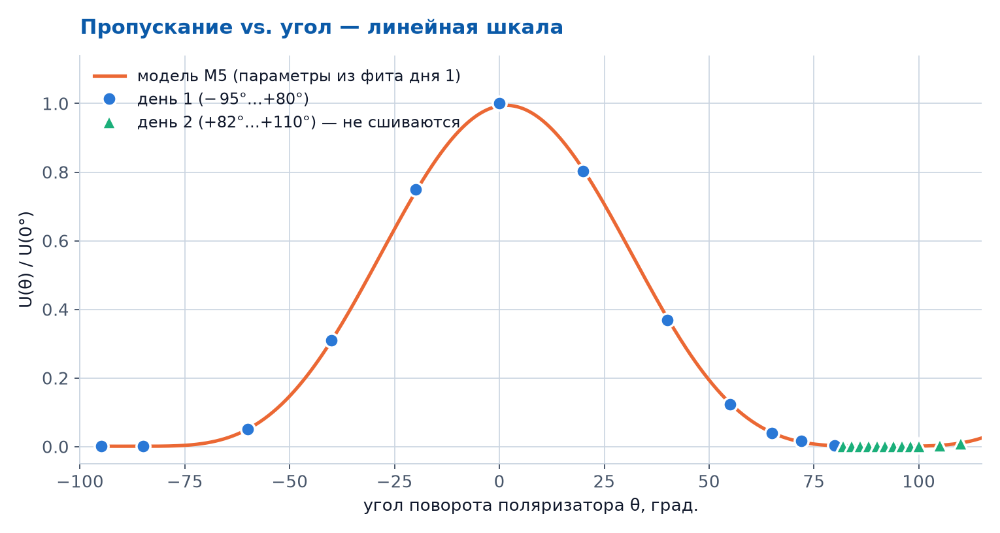
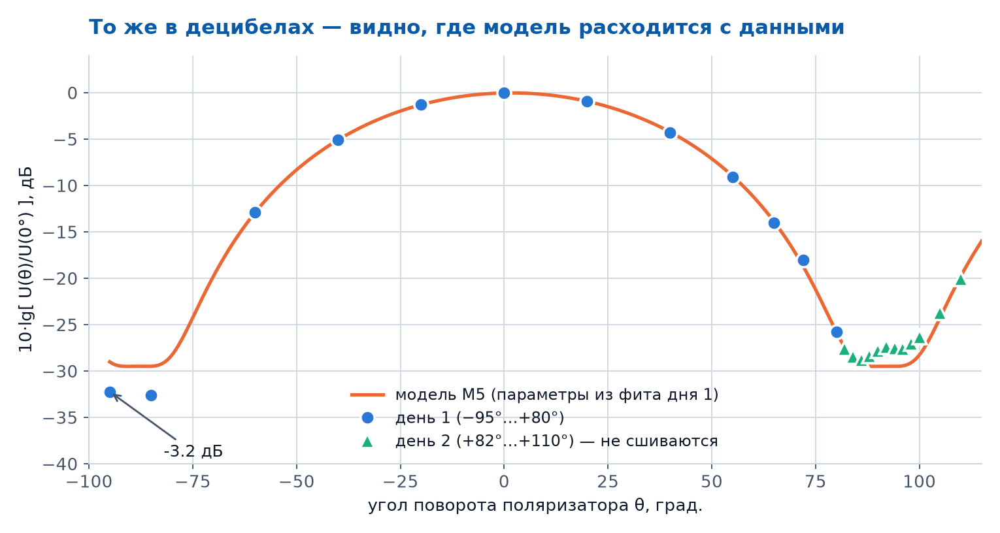
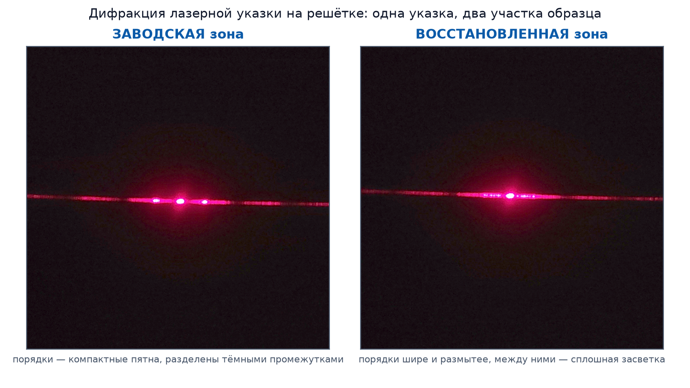
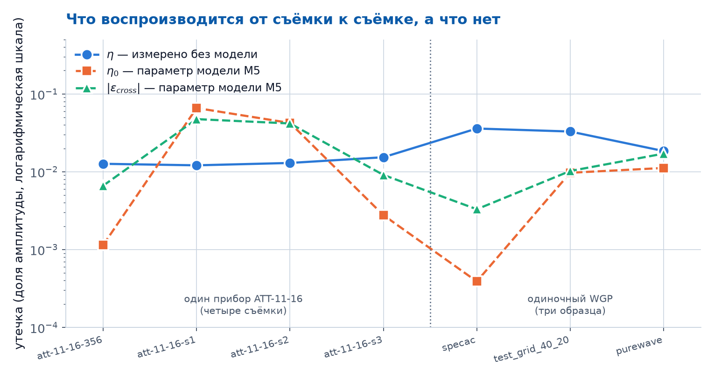
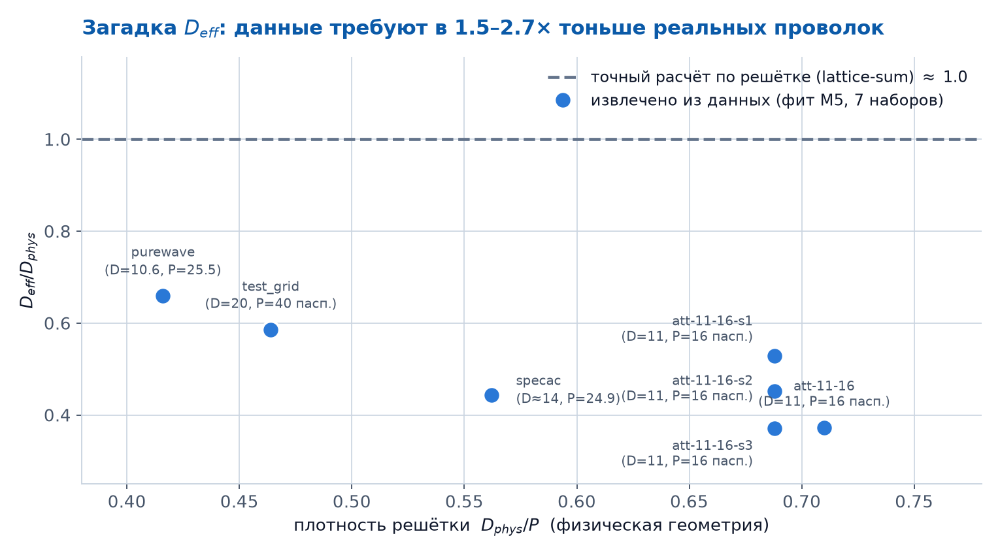

# THz-Unified-Optimizer
## Итоги недели: 28 июля – 4 августа 2026

**Образец недели: purewave** — 7-й WGP-поляризатор в базе.

Параметры по микрофото (ground truth): **P = 25.5 мкм, D = 10.6 мкм**, D/P = 0.42.
Измерения проведены в **два дня**: день 1 (28.07) — углы −95°…+80°; день 2 (03.08) — +82°…+110°.

Отчёт — снимок состояния на **4 августа 2026**. Геометрия образцов пересчитана зоной A позже
(задача A16, 6 августа): purewave стал 24.72 / 9.83 мкм, затем `D_phys` утверждён решением
владельца = 10.0 мкм. Числа этого отчёта не переписаны задним числом — актуальные см.
`research/presentations/HANDOFF_P_20260807.md §4`.

---

## Измерение: пропускание от угла поворота — линейная шкала

🔵 **День 1** (−95°…+80°) — 12 точек. 🟢 **День 2** (+82°…+110°) — 12 точек.
**Оранжевая линия** — теоретическая кривая модели M5, подогнанная только по дню 1.

---

## То же в децибелах: видно качество фита и несшивание

В логарифмической шкале хорошо видно: в диапазоне дня 1 (до 80°) модель описывает данные хорошо.
Точки дня 2 (зелёные треугольники) **не ложатся на ту же кривую** — сигнал в тени выше в ≈2.3 раза.

---

## Почему два дня не сшиваются

**Схема измерения.** Поляризатор purewave — одиночный WGP. Он устанавливается между двумя фиксированными плёночными поляризаторами TYDEX (степень поляризации >99.97%): один задаёт входную поляризацию, второй — анализирует выходную. WGP вращается на угол $\theta$.

**Модель M5** описывает угловую зависимость пропускаемой мощности $U(\theta)$ для такой схемы. Три ключевых параметра: $D_{\text{eff}}$ (эффективный диаметр проволоки), $\eta_0$ (остаточное пропускание WGP в скрещенном положении), $\varepsilon_{cross}$ (паразитный сигнал от оптической схемы).

**Что произошло между днями.** Пучок диаметром ≈1.5–2 мм смещён относительно оси вращения — при повороте он описывает окружность по апертуре. При переустановке образца между днями изменился **участок решётки**, который попадал в пучок в области глубокой тени ($\theta \approx 90°$).

> Угловая шкала не сдвинулась: угол нуля совпал в обоих днях (+1.70° / +1.89°).
> Изменилась утечка $\eta$ — выросла в **2.3 раза** (разные зоны образца, разная однородность).
> DS_rmse при смешивании дней: **2.21 дБ** против **0.49 дБ** (только день 1).

---

## Проверка глазами: дифракция на двух участках purewave

Проволочная сетка — это **дифракционная решётка**. В видимом свете ($\lambda = 0.65$ мкм $\ll P = 25.5$ мкм) она даёт десятки порядков, и чёткость картины напрямую показывает то, что модель Бланко просто **постулирует** — идеальную периодичность.

У purewave центральная зона **восстановлена вручную** (провода провисли из-за отслоения клея, переклеены), края — заводские. Это единственный образец с *известной* нерегулярностью.

| Метрика (3 снимка на 3) | завод. | восст. |
|---|---|---|
| острота пика (пик/медиана) | 86.3 | 44.1 |
| разброс шага между порядками | 0.84 | 1.60 |
| **повторяемость картины** | **+0.427** | **+0.254** |

Последняя строка нагляднее всего: регулярная решётка даёт **одну и ту же** картину от снимка к снимку, разрушенная — каждый раз свою.

**Честно:** выборка 3 на 3, зум между снимками менялся — расстояния по этим кадрам мерить нельзя.
Статус результата — **тенденция**, не количественный вывод. Побочно: период по дифракции **P = 23.4 ± 0.8 мкм** против 25.5 ± 0.9 мкм по микрофото — расхождение 1.8σ, совместимо (но смотрели на *разные* участки).

---

## Утечка $\eta$: что это и почему важно

При полном скрещивании поляризаторов ($\theta = 90°$) идеальный прибор даёт $U = 0$. Реальный — нет: через «запертый» канал проходит когерентный ТГц-импульс с амплитудой **≈1–4% от максимального**.

Это **физический предел динамического диапазона**: затухание упирается в «полку» на уровне $\approx -35$ дБ.

**Что воспроизводится, а что нет:**

| | Разброс ×... |
|---|---|
| $\eta$ — суммарная утечка (без модели) | **×1.3** ✅ |
| $\eta_0$ — параметр модели M5 | **×57** ❌ |
| $\|\varepsilon_{cross}\|$ — параметр M5 | **×7.1** ❌ |

4 съёмки одного прибора ATT-11-16-CA85 (разные условия) + 2 одиночных WGP.
Синяя линия устойчива — оранжевая и зелёная «пляшут».

---

## Загадка $D_{\text{eff}}$: данные требуют вдвое тоньших проволок

Паспортный диаметр: ATT-11-16 — 11 мкм; purewave — 10.6 мкм; specac — ≈14 мкм; test_grid — 20 мкм.
Для всех 7 наборов $D_{\text{eff}}$ из фита в **1.5–2.7 раза меньше** реального диаметра.
Точный расчёт по решётке (lattice-sum) предсказывает $D_{\text{eff}}/D_{\text{phys}} \approx 1.0$ — пунктирная линия.
**Пин к физическому диаметру рушит фит на $\Delta\text{AIC} = +6000…+9000$.**

---

## Кто что сделал за неделю

| Зона | За 28.07 – 04.08 |
|---|---|
| **A** (две-WGP модель) | Вся неделя. A0 — точная линеаризация закона Малюса; A2 — теорема выравнивания (гипотеза «загадка = забытый второй WGP» **опровергнута** аналитически); A3 — HN14 отвергнута, число $\|\varepsilon_{cross}\|$ = 0.0345 **отозвано**; A6 — HN13 отвергнута; A7 — purewave введён 7-м образцом; A8 — оптический контроль зон; A9 — протокол апертурного скана |
| **B** (ядро модели) | **нет новой активности за неделю** — последняя запись 28.07 |
| **C** (данные/пайплайн) | **нет новой активности за неделю** — последняя запись 28.07 21:55 |
| **D** (статья) | **нет новой активности за неделю** — последняя запись 29.07 14:05, сессия закрыта 31.07 |
| **L** (литобзор) | **нет новой активности за неделю** — последняя запись 29.07 19:40, сессия закрыта 31.07 |
| **P** (отчёты) | Зона создана 04.08; этот отчёт — первая работа |

Проверено по фактам `coordination/ACTIVITY.md`: между 31.07 и 04.08 в журнале нет ни одной записи
с тегом `[B]`, `[C]`, `[D]`, `[L]`. Это не «мало отчитались» — это отсутствие работы в зоне.

---

## Что нужно сделать дальше

| Вопрос | Почему важно |
|---|---|
| Провести **апертурный скан** по протоколу A9 | Единственный способ узнать, однороден ли purewave вдоль апертуры — и тем самым проверить, связана ли загадка $D_{\text{eff}}$ с неоднородностью решётки (HN15) |
| Проверить **центровку** образца на оси вращения (`att-11-16-356`, `att-11-16-s1`) | Может объяснить асимметрию $U(\theta)$ в 9.3σ — самый дешёвый тест из оставшихся |
| Перезапускать ли B / C / D / L? | Все стоят с 31.07; у каждой неотработанные запросы от зоны A |
