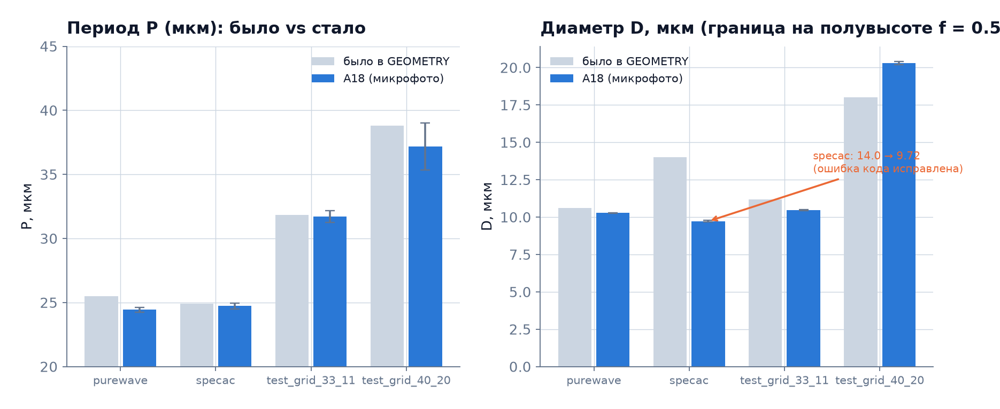
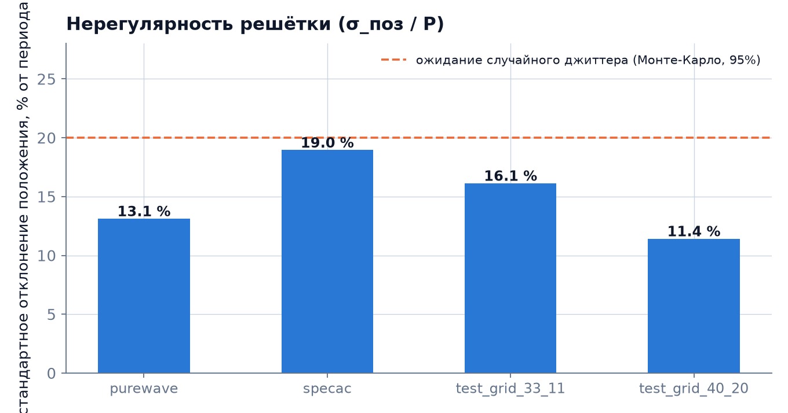
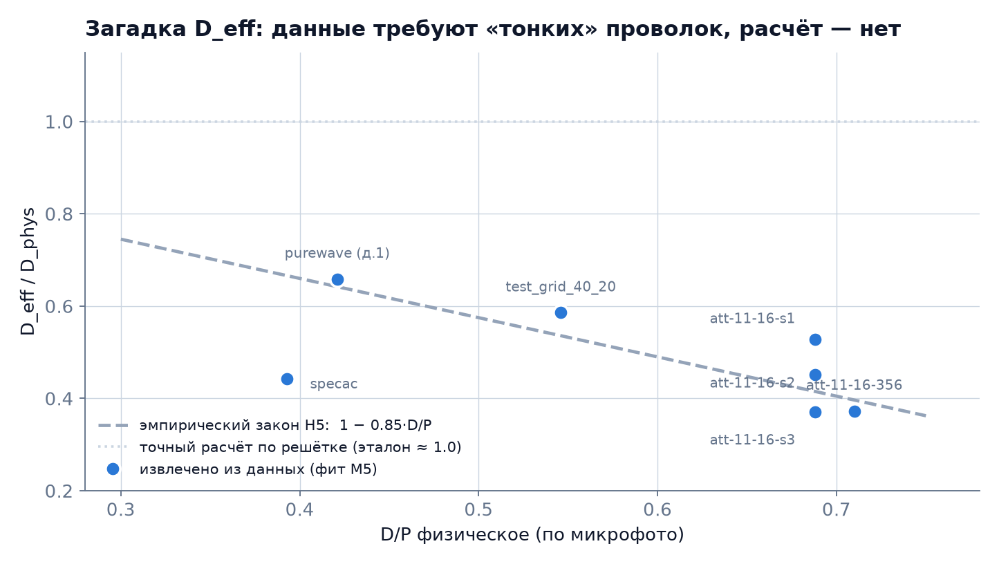

# THz-Unified-Optimizer
## Итоги недели: 4 – 10 августа 2026

**Кому:** владельцу проекта  
**От кого:** Сессия P (P2) — только синтез готовых чисел, каждое со ссылкой (`SOURCES.md`)

> **Главное за неделю в одной фразе:** впервые получены прямые измерения геометрии решёток по микрофотографиям — числа отличаются от паспорта; у `specac` обнаружена грубая ошибка в коде (+44 %).

---

## Итог одной страницей

1. **Главное событие недели — задача A18/A19.** Вы поставили микрофотографии; сессия A их обработала и дала первые *прямые* измерения периода и диаметра для 4 образцов.
2. **Грубая ошибка обнаружена и задокументирована.** В коде `specac` стоял диаметр **14.0 мкм**, реальное измерение — **9.72 мкм** (разница 44 %). Число `D_eff/D_phys` для specac существенно изменится после исправления.
3. **Нерегулярность решётки измерена впервые.** Каждая проволока смещена от своей номинальной позиции примерно на **11–19 % периода** — это реальная структура, не шум. Вопрос: влияет ли это на загадку `D_eff`?
4. **Загадка `D_eff` по-прежнему открыта.** Обновлённые `D/P` не снимают расхождение: данные требуют «тонких» проволок, точный расчёт — нет.
5. **Остальные роли** — остановлены (D, L) или idle (B, C), новой активности за неделю нет.

---

## Словарь недели

> 💡 **Период P** — расстояние между соседними проволоками решётки (мкм).  
> 💡 **Диаметр D** — толщина проволоки (мкм). «Паспортный» — из технических условий; «измеренный» — из микрофото на уровне полувысоты контраста (f = 0.50).  
> 💡 **D_eff** — «электродинамически эффективный» диаметр, который извлекается из подгонки THz-спектра. Загадка: он всегда меньше физического.  
> 💡 **σ_pos / P** — разброс фактического положения проволок относительно идеального равномерного шага, в долях периода.  
> 💡 **GEOMETRY** — словарь констант в коде `fit_lib.py`, задающий P и D для каждого образца. До A18 числа в нём брались из паспорта или старых оценок.

---

## A18/A19 — новые данные из микрофотографий

Вы поставили снимки 2026-08-10; сессия A (шаг A19, исполнитель ник A4) обработала 24 основных кадра и 46 кадров фокус-серий. Метод: граница проволоки на **полувысоте контраста** (f = 0.50), калибровка `cal = 0.1267 мкм/пкс`.

**Вывод:** периоды совпали с паспортом в пределах 1–4 %. По диаметрам — история другая (следующий слайд).

---

## Грубая ошибка в коде: specac

До A18 в `fit_lib.GEOMETRY` стоял `D_specac = 14.0 мкм`. Это число взято ниоткуда — в SUMMARY.md сессии A это названо прямо: «grubaya oshibka».

| | Было в коде | A18 (микрофото) | Паспорт |
|---|---|---|---|
| `specac`, D | **14.0 мкм** | **9.72 ± 0.05 мкм** | 10 мкм |
| `D/P` | 0.562 | **0.393** | — |

Это не опечатка на 1–2 %: разница в **44 %**. Всё, что считалось для `specac` до A18, использовало неверную геометрию. Числа `D_eff/D_phys` для этого образца будут пересчитаны после исправления `GEOMETRY` (задача B).

> ⚠ Текущие значения `D_eff/D_phys` для `specac` из отчёта 04.08 **устарели**. Обновлять после правки B.

---

## Нерегулярность решётки — первые прямые данные

Каждая проволока смещена от своей «идеальной» позиции независимо. Это не дрейф намотки (проверено ACF), а случайный **джиттер** — каждая нить гуляет отдельно.

**Почему это важно:** гипотеза о том, что загадка `D_eff` связана с нерегулярностью решётки (HN15), требует пересмотра. У `purewave` — образца с *известным* дефектом (провисший центр) — нерегулярность ниже, а `D_eff/D_phys` *выше*, чем у остальных. Статус гипотезы: **НЕ ПОДДЕРЖАНА**.

---

## Загадка D_eff: статус после A18

Обновлённые D/P (по микрофото, f = 0.50) сдвинули точки `specac` и `test_grid_40_20`. Расхождение между данными и точным расчётом (~1.0) **не исчезло**: `D_eff/D_phys` всё ещё 0.37–0.66 против ≈1.0 у теории.

**Что изменится дальше:** после того как B исправит `GEOMETRY` и зона A перезапустит фиты для `purewave` и `test_grid_40_20` (период уехал на 4.2 % и 4.2 % соответственно), точки могут сдвинуться.

---

## По ролям: активность за неделю

| Роль | Статус | Что сделано |
|---|---|---|
| **A** | active | **A18/A19 закрыта** — геометрия 4 образцов по микрофото; FFT-механизм отказа объяснён |
| **B** | idle | Задача `B-prod-fix` (2 `NameError`) на паузе; ветка `session/B-prod-fix` готова |
| **C** | idle | Ждёт приёмки v0.2 владельцем у спектрометра |
| **D** | stopped | Курс §0–§10 (76 стр.) написан, ждёт чтения владельца |
| **L** | stopped | Очередь: конкурент IRMMW-THz 2025 + 4 ключевых PDF |

---

## Что требует вашего решения

| Вопрос | Почему важно | Где |
|---|---|---|
| **Конвенция границы диаметра** (f = 0.50 как в A18 или f ≈ 0.25 как в ваших кликах?) | Разница **0.5–0.75 мкм** в D → сдвиг `D_eff/D_phys` для всех образцов | `QUESTIONS.md` A-1 |
| **Утверждение таблицы A18** (GEOMETRY_A18) | Блокирует исправление кода (B), пересчёт H5, правку §4 статьи | BOARD.md строка A |
| **4 PDF через институциональный доступ** | Блокирует заявку на новизну в статье | `PLAN_2026-08-10.md` |
| **Приёмка v0.2 приложения** | C не может двигаться дальше | BOARD.md строка C |
| **Чтение курса D** (76 стр.) | Приоритет D: «восстановить контроль над физикой» | BOARD.md строка D |

---

## Что дальше (после ваших решений)

1. **B** исправляет `GEOMETRY` → `specac D` и диаметры по A18.
2. **A** перезапускает фиты `purewave` и `test_grid_40_20` → обновляет `D_eff/D_phys`.
3. **P** обновляет fig1 и fig3 (цифры `D/P` и `D_eff/D_phys` изменятся).
4. **D** правит приложение Б статьи после утверждения геометрии.
5. **L** — конкурент IRMMW-THz 2025: читать без промедления.
