# Отчёт A19 — микрофотографии проволочных поляризаторов: период, диаметр, однородность намотки

**Кому:** владельцу проекта; копия — зонам B (модель) и D (статья).
**Кто считал:** сессия A (заходы A4 и A5), 2026-08-10.
**Исходные данные:** поставка микрофото и обмеров от 2026-08-10, `data_pool/<набор>/microscopy/`.
**Скрипт:** `research/two_wgp/a18_microscopy_lattice.py`. **Артефакты:** `research/results/a18_microscopy/`.
**Краткий свод чисел:** `research/results/a18_microscopy/SUMMARY.md` (этот отчёт — его развёрнутая версия).

---

## 1. Резюме

Вы прислали 70 микрофотографий четырёх поляризаторов и таблицы ручных обмеров из программы
микроскопа. Я извлёк из снимков положение каждой проволоки, посчитал период, диаметр и то,
насколько намотка отклоняется от идеально равномерной, и сверил три источника: снимок, ваши
обмеры и паспорт.

**Четыре главных вывода.**

1. **Намотка нерегулярна, и сильно.** Средний шаг у всех четырёх образцов выдержан, но каждая
   отдельная проволока смещена от «своего» места на 3–5 мкм, то есть на 11–19 % периода.
   Максимальные отклонения — до 11.5 мкм. Это не погрешность измерения: разброс *ширины*
   проволоки в том же кадре в 30–50 раз меньше разброса их положений.

2. **Ваши собственные ручные обмеры это подтверждают независимо.** Разброс периода в
   `_P.csv` (23–28 %) совпал с разбросом, который я получил автоматически из снимков
   (20–27 %), с точностью до нескольких процентных пунктов. Два измерения без общего звена
   дали одно и то же. Практическое следствие: **гистограмма в `_P_stat.csv` показывает
   реальную структуру образца, а не дрожание руки** — читать её как погрешность измерения
   нельзя.

3. **Гипотеза «микроскоп систематически завышает на +0.2 мкм» не подтвердилась — но
   наблюдение было верным и указало на реальный эффект.** Решающий образец
   `test_grid_40_20` (паспорт 20 мкм) даёт превышение **+0.92 мкм**, а не +0.2 и не +0.4.
   Оба варианта отвергаются статистически (p = 0.0002 и p = 0.0026). Настоящая причина
   найдена: вы ставите границу проволоки не на полувысоте перепада яркости, а у его
   подножия — примерно на уровне 0.1–0.33 от контраста. Это даёт устойчивое смещение около
   +0.3 мкм на каждую границу, а у некомпланарного `test_grid_40_20` оно дополнительно
   раздувается расфокусировкой. То есть «систематики микроскопа» как отдельной сущности нет,
   есть **конвенция границы**, и она объясняет все три образца сразу.

4. **Период двух образцов сдвинулся на 4 % от того, что стоит в коде модели.** `purewave`
   25.5 → 24.44 мкм, `test_grid_40_20` 38.8 → 37.18 мкм. Период в модели зафиксирован жёстко,
   поэтому этим двум образцам нужен перезапуск подгонки. У `specac` и `test_grid_33_11`
   сдвиг меньше погрешности — перезапуск не нужен.

**Что теперь нужно от вас — три решения.**

- **Какую границу считать «диаметром».** У круглой проволоки на микрофото нет единственной
  ширины: сдвиг уровня границы с 20 % на 80 % контраста меняет диаметр на 1.3–1.9 мкм
  (6–20 %) при неизменном периоде. Я считал на полувысоте; вы — заметно ниже. Число «диаметр»
  в статье должно идти с указанием конвенции, иначе его нельзя воспроизвести.
- **Когда перезапускать подгонки** для `purewave` и `test_grid_40_20` — сейчас или после того,
  как вы утвердите таблицу целиком.
- **Снимать ли калибровочную шкалу в одном кадре с образцом** в следующий раз. Сейчас
  калибровка 0.126739 мкм/пиксель взята как данность, проверить её нечем.

Закон H5 не пересчитывался, файл геометрии модели не правился — по протоколу это делается
один раз после того, как вы утвердите таблицу.

---


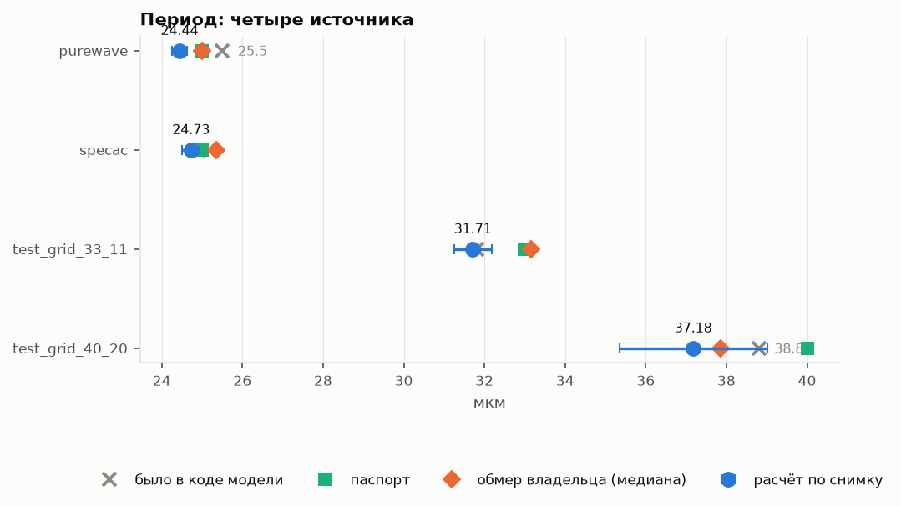{width=100%}

**Рис. 1. Период: четыре источника на одной шкале.** Если смотреть только одну картинку — эту. Синие точки с усами — расчёт по снимкам (ус = стандартная ошибка), ромб — ваш обмер, квадрат — паспорт, серый крестик — значение, стоявшее в коде модели. Видно главное: у `purewave` и `test_grid_40_20` крестик заметно правее синей точки — это и есть тот сдвиг периода на 4 %, из-за которого нужен перезапуск подгонок. У `specac` и `test_grid_33_11` все четыре источника собраны плотно.

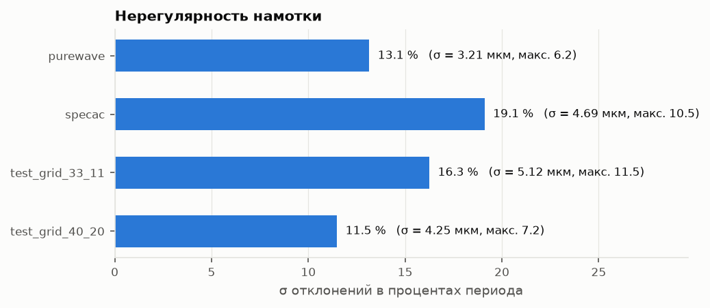{width=100%}

**Рис. 2. Нерегулярность намотки: разброс положений в процентах периода.** Вторая по важности картинка. Столбик — насколько каждая проволока в среднем отклоняется от места, где она должна была бы стоять при идеально равномерной намотке. Одиннадцать-девятнадцать процентов периода — это много: у `specac` отдельные проволоки уходят на 10 мкм при периоде 25.

## 2. Что было прислано

### 2.1 Состав поставки

| Набор в репозитории | Ваша папка | Паспорт `D`/`P`, мкм | Снимков | CSV |
|---|---|---|---|---|
| `purewave` | `purewave-10-25` | 10 / 25 | 6 | `_P`, `_P_stat` |
| `specac` | `specac-10-25` | 10 / 25 | 6 | `_D`, `_P`, `_P_stat` |
| `test_grid_33_11` | `wgp-11-33` | 11 / 33 | 7 | `_D`, `_P`, `_P_stat` |
| `test_grid_40_20` | `wgp-20-40` | 20 / 40 | 5 мультифокус + 46 в фокус-сериях | `_D`, `_P`, `_P_stat` |

⚠ Имена наборов в репозитории идут в обратном порядке: у вас `<диаметр>-<период>`, здесь
`test_grid_<период>_<диаметр>`. Перепутать легко, последствия тихие.

Кадр — 2048 × 1536 пикселей (у `test_grid_40_20` 2028 × 1516). При калибровке
**0.126739 мкм/пиксель** поле зрения по горизонтали равно **259.6 мкм**, то есть в кадр
попадает от 6 до 11 проволок. Это ключевое ограничение всей работы: статистика по одному
кадру короткая, и всё, что требует длинных последовательностей, недоступно.

### 2.2 Режимы съёмки и полярность

У `purewave`, `specac`, `test_grid_33_11` применён негатив: проволока выглядит **светлой**
полосой. У `test_grid_40_20` негатива нет: проволока **тёмная**. Я не стал доверять этому
описанию и определял полярность по самому изображению (критерий — в §3.2). На всех 24
основных кадрах автоматическое определение совпало с описанием: `bright` шесть раз подряд
у `purewave` и `dark` пять раз у `test_grid_40_20` (поле `polarity.wire` в JSON-артефактах).

### 2.3 Фокус-серии `test_grid_40_20`

Проволоки этого образца лежат на разной глубине, поэтому один кадр не даёт резкости по всему
полю. В поставке есть и результат сведения (`multifocus_1..5`), и исходные серии по шагу
винта фокуса: `s1_step0.14mm` (4 кадра), `s2_step0.10mm` (5), `s3_step0.05mm` (11),
`s4_step0.05mm` (12), `s5_step0.05mm` (14) — всего 46 кадров. Эти серии оказались не
вспомогательным, а **решающим материалом** для вопроса о диаметре (§7).

### 2.4 Формат обмеров

`_D.csv` и `_P.csv` — списки длин отрезков, по одному отрезку в строке; заполнена только
колонка «Длина, мкм», остальные — прочерк. Кодировка cp1251, разделитель `;`, десятичная
запятая, в заголовках неразрывный пробел. `_P_stat.csv` — гистограмма программы микроскопа
**по тем же самым отрезкам**: сумма колонки «Количество» равна числу строк `_P.csv`
(52 / 50 / 50 / 50 — проверено на всех четырёх, поле `P_stat.sum_n`). Самостоятельной
информации она не несёт.

Объёмы: `_D` — нет / 22 / 10 / 14 записей; `_P` — 52 / 50 / 50 / 50.

### 2.5 Чего в поставке нет

- **`_D.csv` у `purewave`** — только период. Диаметр этого образца сверить с вашим обмером
  не с чем; сравнение идёт только с паспортом (10.0) и со старым значением в коде (10.6).
- **`att-11-16` целиком** — прибор уехал. Для него остаются три прежних микрофото, к которым
  этот метод я не применял (задача не ставилась). Прогноз по нему — в §8.
- **Калибровочной шкалы** — ни одного кадра с гребёнкой. Значение 0.126739 мкм/пиксель принято
  из карты поставки без независимой проверки. Все относительные выводы (нерегулярность,
  нечувствительность периода к границе) от неё не зависят; абсолютные значения `P` и `D`
  зависят линейно.
- **Первых трёх записей `test_grid_33_11_P.csv`** можно считать, что нет: 352, 246 и 212 мкм
  при ожидаемых ~33. Робастный фильтр (модифицированный z-счёт по медианному отклонению)
  пометил ровно эти три и никакие другие; после их удаления среднее падает с 46.8 до
  **32.5 мкм**, СКО — с 59.2 до 6.6 (`a18_csv_measurements.json`, узел
  `test_grid_33_11.P.outliers`). Во всех остальных файлах выбросов не найдено.

---

> **Отметка о происхождении разделов 3–12.** Заход A5 остановился на лимите сессии, дописав
> отчёт до §2. Разделы ниже собраны ORCH (O7) **из тех же артефактов** `a18_*.json`, скрипта
> `a18_microscopy_lattice.py` и проверенного отчёта A4; новых расчётов по изображениям здесь нет,
> кроме двух явно помеченных пересчётов (§7.2, §8). Каждое число сопровождается ссылкой на узел
> артефакта, чтобы его можно было перепроверить одной командой.

---

## 3. Метод

### 3.1 Что именно требовалось сделать

Ваш алгоритм в исходной формулировке: взять координаты центров проволок как среднее между двумя
границами → пронумеровать → получить средний период → построить идеальную решётку с этим периодом,
привязав первую идеальную проволоку к первой измеренной → смотреть отклонения реальных координат
от идеальных. Он реализован дословно; всё остальное в §3 — это то, без чего шаг 1 не выполняется
на реальном кадре.

### 3.2 Полярность

Проволока — светлая полоса или тёмная — определяется по самому изображению, а не по описанию
поставки (`detect_polarity`). На всех основных кадрах автоопределение совпало с вашим описанием:
`bright` у `purewave`, `specac`, `test_grid_33_11`, `dark` у `test_grid_40_20` (поле `wire` в
`frames_summary`). Единственное расхождение — один кадр фокус-серии `s2_step0.10mm`
(`wgp-20-40_10_8_2026_5.bmp`), где определилось `bright`: кадр сильно расфокусирован, контраст
инвертировался бликом. Кадр в надёжные не попал.

### 3.3 Наклон проволок в кадре

Проволоки не строго вертикальны: измеренный наклон от **−0.15°** до **−1.94°** (`tilt_deg`).
Если усреднять профиль яркости по столбцам «как есть», наклон размывает границы и систематически
завышает ширину. Поэтому профиль строится по скошенным строкам (`sheared_profile`) с наклоном,
оценённым по самому кадру (`estimate_slope`, разбиение на 8 полос и взаимная корреляция между
ними). У `purewave` наклон −0.30°, у `test_grid_40_20` доходит до −1.4°.

### 3.4 Границы и центры — двухстадийно

Одностадийный порог на этих снимках рассыпается: внутри проволоки `test_grid_40_20` есть бликовая
полоса, которая режет её на две. Поэтому:

1. **Ядра промежутков** — участки, где профиль глубоко внизу (ниже 15 % контраста). Промежуток —
   открытая апертура, он всегда чистый.
2. Между двумя соседними промежутками лежит ровно одна проволока. Её границы ищутся как **первое
   пересечение уровня 50 % контраста** при движении от промежутка внутрь проволоки — то есть по
   монотонному склону, куда внутренняя структура не достаёт.
3. Центр = среднее двух границ — это и есть ваш шаг 1.

Слипшиеся пары (нерегулярность сводит соседей вплотную) распознаются и помечаются: поля `n_units`
(сколько объектов найдено) против `n_wires` (сколько принято) и `n_merged`.


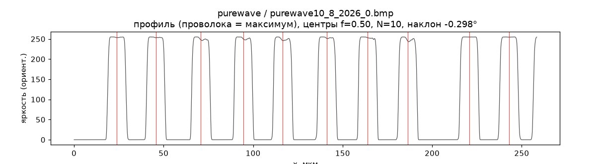{width=100%}

**Рис. 3. Как выглядит измерение: профиль яркости одного кадра purewave.** Серая кривая — яркость вдоль кадра поперёк проволок (после выравнивания наклона). Плоские полки наверху — проволоки, провалы — промежутки. Красные вертикальные штрихи — найденные центры, каждый посчитан как середина между двумя границами на полувысоте, то есть ровно по вашему шагу 1. Хорошо видно, почему край меряется уверенно: склоны почти отвесные. И так же видно, что расстояния между красными штрихами заметно разные — это и есть нерегулярность, которую дальше меряем числом.

### 3.5 Три оценки периода — намеренно

- `P_mean` — среднее разностей соседних центров, ровно как в вашем алгоритме;
- `P_lsq` — наклон прямой, подогнанной методом наименьших квадратов к координатам центров по
  номеру проволоки (контрольная оценка, устойчивее к одиночному промаху);
- `P_density` — по плотности проволок на кадре; **именно она вынесена в итоговые таблицы**, потому
  что не зависит от того, попала ли крайняя проволока целиком в кадр.

Отчётный период образца — среднее `P_density` по кадрам ± стандартная ошибка среднего
(`P_density.mean`, `P_density.sem`). Расхождение между оценками разобрано в §10.1 — это главная
оговорка работы.

### 3.6 Идеальная решётка и вектор отклонений

Строятся обе решётки: **ваша** (период = `P_mean`, привязка к первой проволоке, `dev_owner`) и
контрольная **МНК** (свободные период и сдвиг, `dev_lsq`). Разница между ними показывает, не
испортила ли привязка к первой проволоке картину, если сама первая проволока сидит криво. На
практике оценки совпали в пределах процентов (`dev_std_um` против `dev_owner_std_um` в
`frames_summary`: например у `purewave` кадр 0 — 3.033 против 3.036).

### 3.7 Нуль-модель

Чтобы отличить «беспорядок» от «дрейфа намотки», результаты сравниваются с моделью, в которой
каждая проволока смещена независимо и одинаково распределённо (i.i.d.), при том же числе проволок:
4000 испытаний Монте-Карло (`null_model_iid`). Сравниваются две величины — автокорреляция
последовательности периодов на лаге 1 и отношение разброса периодов к разбросу отклонений.

### 3.8 Скан порога границы

Весь расчёт повторяется на семи уровнях границы: 0.20, 0.30, 0.40, 0.50, 0.60, 0.70, 0.80 от
контраста (`threshold_scan`, `threshold_effect`). Это прямая проверка вашей же оговорки —
насколько выводы зависят от того, где считать край проволоки.

### 3.9 Воспроизведение

```powershell
cd "C:\Users\pop\Antigravity IDE\THz-Unified-Optimizer"
.venv\Scripts\python.exe research\two_wgp\a18_microscopy_lattice.py csv      # только CSV-обмеры
.venv\Scripts\python.exe research\two_wgp\a18_microscopy_lattice.py frame <путь к .bmp>
.venv\Scripts\python.exe research\two_wgp\a18_microscopy_lattice.py sample purewave
.venv\Scripts\python.exe research\two_wgp\a18_microscopy_lattice.py all      # все четыре образца
.venv\Scripts\python.exe research\two_wgp\a18_microscopy_lattice.py focus    # фокус-серии 40_20
```

Калибровка берётся из одного места — константы `CAL_UM_PER_PX = 0.126739` в начале скрипта,
источник указан там же (`data_pool/MICROSCOPY.md`).

---

## 4. Результаты по образцам

Общая шапка для всех таблиц: `P` — период по плотности, среднее по кадрам ± стандартная ошибка;
`D` — диаметр, медиана по всем найденным проволокам, граница на полувысоте; σ_откл — разброс
отклонений от идеальной решётки; «доля» — `D/P`, заполнение периода металлом.

### 4.1 purewave

| Величина | Значение | Откуда |
|---|---|---|
| Период | **24.44 ± 0.19 мкм** | `P_density.mean/sem` |
| Диаметр | **10.279 мкм**, разброс 0.110, N = 59 | `pooled.D` |
| σ_откл | **3.21 мкм**, макс. 6.22 | `pooled.dev` |
| σ_откл / P | **13.1 %** | `pooled.ratio_std_over_P` |
| Разброс периодов | σ_P/P = 19.7 % | `pooled.sigma_P_over_P` |
| Доля металла | 0.433 | `pooled.duty_D_over_P` |

Приняты **все 6 кадров**. Два из них (`..._3` и `..._4`) перекрываются — 8 общих проволок
(`overlapping_frames`), поэтому независимых кадров пять, и это учтено при оценке погрешности.
Найден один промежуток **34.3 мкм** при медианном 22.8 — это 1.5 периода, то есть не пропущенная
проволока, а разъехавшаяся пара.

Гистограмма периодов двугорбая, но горбы частично наведены перекрытием кадров 3 и 4 — как вывод
это не годится, отмечено как наблюдение.

Графики: `a18_purewave_frame0.png` — профиль яркости одного кадра с найденными границами и
центрами (видно, что края проволок ловятся уверенно, а промежутки гуляют); `a18_purewave.png` —
сводка по образцу: распределение периодов, вектор отклонений, распределение диаметров.

### 4.2 specac

| Величина | Значение | Откуда |
|---|---|---|
| Период | **24.73 ± 0.22 мкм** | `P_density.mean/sem` |
| Диаметр | **9.720 мкм**, разброс 0.320, N = 39 | `pooled.D` |
| σ_откл | **4.69 мкм**, макс. 10.46 | `pooled.dev` |
| σ_откл / P | **19.0 %** — худший из четырёх | `pooled.ratio_std_over_P` |
| Разброс периодов | σ_P/P = 27.0 % | `pooled.sigma_P_over_P` |
| Доля металла | 0.390 | `pooled.duty_D_over_P` |

Приняты **4 кадра из 6**: два отбракованы по слипшимся парам и низкому контрасту (у них
σ_откл подскакивает до 7.33 и 6.27 против 4.1–4.5 у принятых — `frames_summary`).

Это образец с лучшими терагерцевыми данными набора (отношение сигнал/шум в тени 68×), и именно
у него в коде модели стоял диаметр **14.0 мкм**. Микрофото даёт 9.72 при паспорте 10.0 и вашем
обмере 10.25. Прежнее значение опровергнуто третьим независимым способом.

Графики: `a18_specac_frame0.png`, `a18_specac.png`.

### 4.3 test_grid_33_11

| Величина | Значение | Откуда |
|---|---|---|
| Период | **31.71 ± 0.47 мкм** | `P_density.mean/sem` |
| Диаметр | **10.474 мкм**, разброс 0.267, N = 46 | `pooled.D` |
| σ_откл | **5.12 мкм**, макс. 11.52 — наибольший абсолютный | `pooled.dev` |
| σ_откл / P | **16.1 %** | `pooled.ratio_std_over_P` |
| Разброс периодов | σ_P/P = 23.0 % | `pooled.sigma_P_over_P` |
| Доля металла | 0.323 — самая разреженная решётка набора | `pooled.duty_D_over_P` |

Приняты **6 кадров из 7**. Один кадр со слипшейся парой отбракован.

Графики: `a18_test_grid_33_11_frame0.png`, `a18_test_grid_33_11.png`.

### 4.4 test_grid_40_20 — самый трудный образец

| Величина | Значение | Откуда |
|---|---|---|
| Период | **37.18 ± 1.83 мкм** | `P_density.mean/sem` |
| Диаметр | **20.302 мкм**, разброс 0.353, N = 11 | `pooled.D` |
| σ_откл | **4.25 мкм**, макс. 7.17 | `pooled.dev` |
| σ_откл / P | **11.4 %** — наименьший из четырёх | `pooled.ratio_std_over_P` |
| Разброс периодов | σ_P/P = 20.5 % | `pooled.sigma_P_over_P` |
| Доля металла | 0.530 — самая плотная решётка набора | `pooled.duty_D_over_P` |

Приняты **всего 2 мультифокусных кадра из 5**: в остальных проволоки слипаются или контраст
падает ниже порога надёжности. Отсюда и втрое большая погрешность периода, и всего 11 проволок
на диаметр — это самая слабая статистика в работе.

Поэтому образец перепроверен по фокус-сериям: 19 пригодных кадров из 46 дают
**P = 37.04 ± 1.09 мкм** (`a18_test_grid_40_20_focus.json`, узел `_summary`) — сходится с
мультифокусной оценкой в пределах погрешности. Именно эти серии дали ответ про диаметр (§7.2).

Графики: `a18_test_grid_40_20_frame0.png`, `a18_test_grid_40_20.png`,
`a18_test_grid_40_20_focus.png` (зависимость периода и диаметра от степени расфокусировки).

---

## 5. Однородность намотки и нерегулярность периода

### 5.1 Два разных утверждения, которые легко перепутать

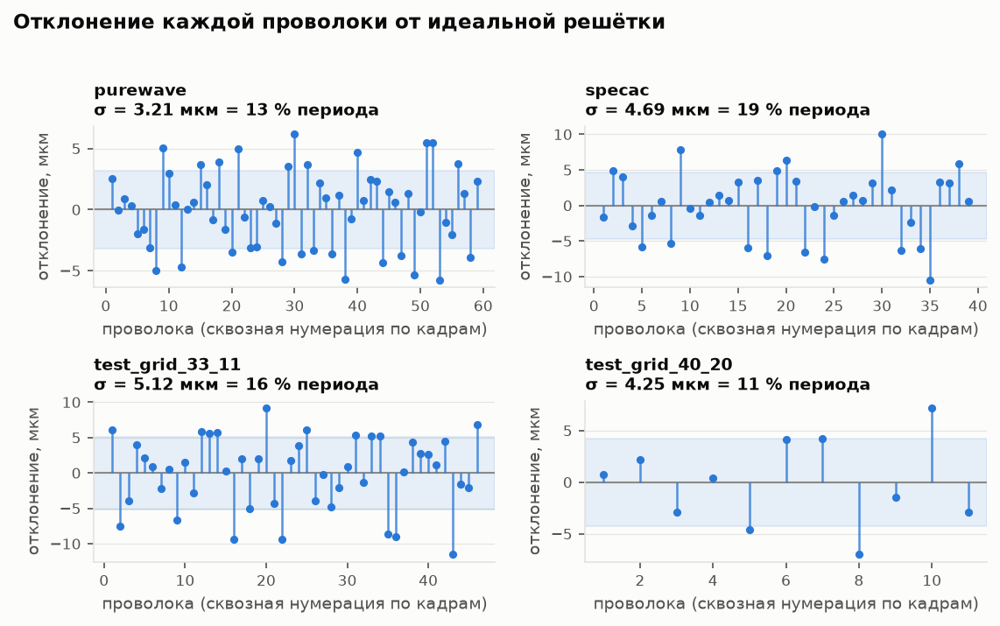{width=100%}

**Рис. 4. Отклонение каждой проволоки от идеальной решётки.** Это прямой результат вашего алгоритма: по горизонтали — номер проволоки, по вертикали — насколько она смещена от идеального места. Бледная полоса — коридор ±σ. Обратите внимание на характер картинки: точки скачут вверх-вниз без наклона и без волны. Если бы намотка «уезжала» (шаг систематически рос или падал), точки выстроились бы по наклонной; если бы был периодический дефект механизма — получилась бы волна. Ни того, ни другого нет.

«Период выдержан» и «проволоки стоят на своих местах» — не одно и то же. Первое про среднее,
второе про каждую отдельную проволоку. У всех четырёх образцов **первое верно, второе нет**.

Средний шаг устойчив: кадровые средние держатся в пределах ±2 % (у `purewave` 23.9…25.0 при
общем 24.44 — `P_density.values`). Значимого линейного тренда отклонений нет ни в одном из
18 надёжных кадров: наибольшее по модулю значение критерия |t| = 2.38 при 24 проверках —
столько и ожидается случайно (`frames_summary.trend_t`).

При этом каждая проволока смещена от своего идеального места на **11–19 % периода**:

| Образец | σ_откл, мкм | σ_откл / P | макс. отклонение, мкм |
|---|---|---|---|
| purewave | 3.21 | 13.1 % | 6.22 |
| specac | 4.69 | 19.0 % | 10.46 |
| test_grid_33_11 | 5.12 | 16.1 % | 11.52 |
| test_grid_40_20 | 4.25 | 11.4 % | 7.17 |

### 5.2 Это беспорядок, а не дрейф

Дрейф намотки (шаг медленно уходит) и независимый джиттер (каждая проволока смещена сама по себе)
дают одинаковую σ, но разную структуру. Две проверки:

| Образец | ACF₁ периодов | коридор i.i.d. | σ_P/σ_откл | коридор i.i.d. |
|---|---|---|---|---|
| purewave | −0.346 | [−0.780, +0.073] | 1.49 | [1.13, 1.91] |
| specac | −0.447 | [−0.780, +0.073] | 1.48 | [1.13, 1.91] |
| test_grid_33_11 | −0.176 | [−0.801, +0.178] | 1.42 | [1.14, 1.98] |
| test_grid_40_20 | −0.414 | [−0.787, +0.219] | 1.82 | [1.40, 2.17] |

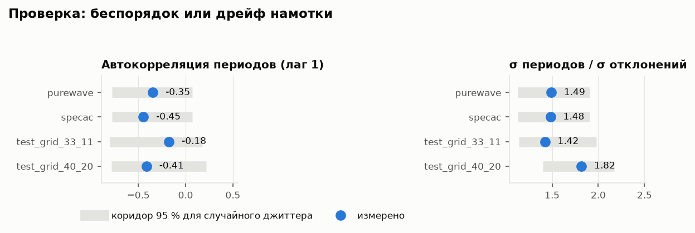{width=100%}

**Рис. 5. Проверка на дрейф: измеренное против модели случайного джиттера.** Серая полоса — коридор, в который попадают 95 % случайных решёток с независимым смещением каждой проволоки (4000 испытаний Монте-Карло при том же числе проволок). Синяя точка — измеренное значение. Все восемь точек внутри коридоров, то есть наблюдаемая картина неотличима от чистого беспорядка. Накопительной ошибки шага нет.

Все восемь значений **внутри** 95 %-коридоров нуль-модели (`structure`, `null_model_iid`).
Накопительной ошибки шага нет: намотка не «уезжает», она дрожит. Отрицательная автокорреляция
периодов — это ровно то, что даёт независимый джиттер: за увеличенным промежутком чаще следует
уменьшенный, потому что сумма фиксирована решёткой.

### 5.3 Главный аргумент: это подтверждают ваши собственные обмеры

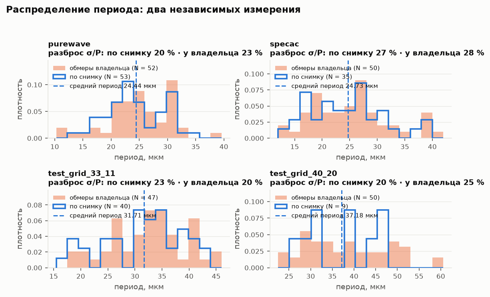{width=100%}

**Рис. 6. Распределение периода: снимок против ваших ручных обмеров.** Оранжевая заливка — ваши обмеры из программы микроскопа, синий контур — автоматический расчёт по снимкам. Оси нормированы на плотность, потому что объёмы выборок разные. Ширина распределений совпадает — а именно ширина здесь и есть измеряемая величина. Два способа, не имеющие ничего общего, дают один и тот же разброс: значит это свойство образца, а не метода. Именно поэтому гистограмму в `_P_stat.csv` нельзя читать как погрешность измерения.

Самое сильное в этом разделе — не мои числа, а их совпадение с вашими.

| Образец | σ_P/P по снимкам | σ_P/P по вашему `_P.csv` |
|---|---|---|
| purewave | 19.7 % | 23.3 % |
| specac | 27.0 % | 27.6 % |
| test_grid_33_11 | 23.0 % | 20.4 % |
| test_grid_40_20 | 20.5 % | 24.9 % |

Два измерения без общего звена — автоматическое по яркости и ручное кликами в программе
микроскопа — дали одно и то же с точностью 1–5 процентных пунктов. **Практический вывод:
гистограмма в `_P_stat.csv` показывает реальную структуру образца, а не разброс измерения.**
Её нельзя интерпретировать как погрешность.

Контрольный довод: разброс *ширины* проволоки внутри кадра σ_D = 0.11…0.35 мкм при разбросе
*положений* 3.2…5.1 мкм. Край локализуется в 15–45 раз точнее, чем гуляют центры, — значит
разброс положений не может быть артефактом детектора границ.

### 5.4 Дефекты

- `purewave`: один промежуток 34.3 мкм при медианном 22.8 (1.5 периода).
- Слипшиеся пары: 2 кадра `specac`, 1 кадр `test_grid_33_11`, 3 кадра `test_grid_40_20`.

### 5.5 Чего сказать нельзя

**Периодичность самих отклонений не определяется.** В кадр попадает 6–11 проволок, спектр на
такой длине не имеет смысла. Если дефект намотки имеет период в десятки проволок, эти данные его
не увидят. Нужна съёмка с меньшим увеличением или сшивка соседних кадров.

---

## 6. Сверка трёх источников

| Образец | | Паспорт | Ваш обмер (CSV) | Расчёт по снимку | В коде модели |
|---|---|---|---|---|---|
| purewave | P | 25 | 25.02 (медиана 25.0, N = 52) | **24.44 ± 0.19** | 25.5 |
| | D | 10 | — | **10.28** (N = 59) | 10.6 |
| specac | P | 25 | 25.25 (медиана 25.35, N = 50) | **24.73 ± 0.22** | 24.9 |
| | D | 10 | 10.25 ± 0.04 (медиана 10.2, N = 22) | **9.72** (N = 39) | 14.0 |
| test_grid_33_11 | P | 33 | 32.52 после чистки (медиана 32.7, N = 47) | **31.71 ± 0.47** | 31.82 |
| | D | 11 | 11.06 ± 0.15 (медиана 11.2, N = 10) | **10.47** (N = 46) | 11.2 |
| test_grid_40_20 | P | 40 | 37.85 (N = 50) | **37.18 ± 1.83** | 38.8 |
| | D | 20 | 20.92 ± 0.14 (медиана 20.95, N = 14) | **20.30** (N = 11) | 18.0 |

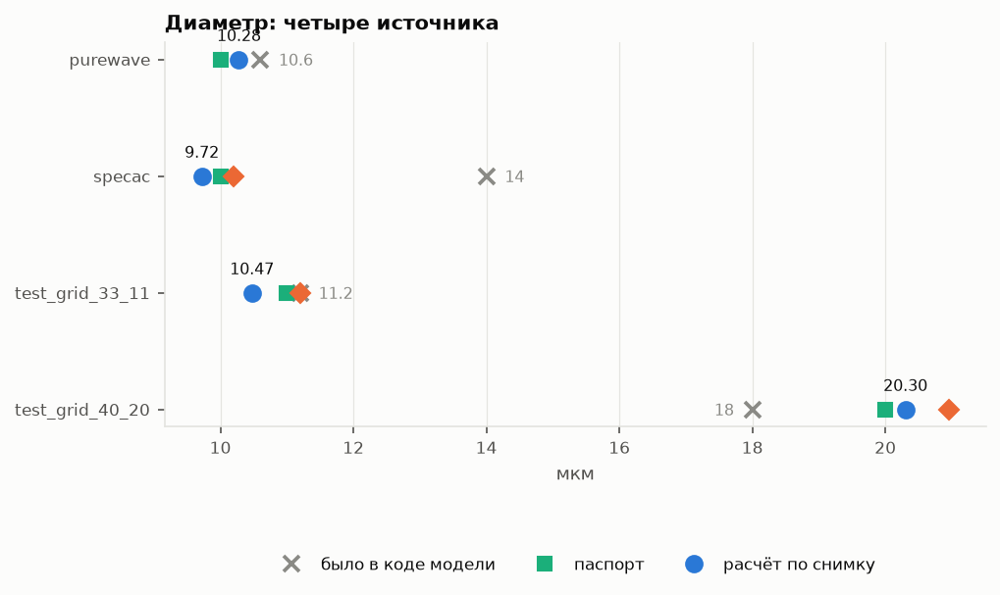{width=100%}

**Рис. 7. Диаметр: четыре источника.** Та же схема, что на рис. 1. Здесь бросаются в глаза два серых крестика, стоящие особняком: `specac` с диаметром 14.0 и `test_grid_40_20` с 18.0 — значения, которые были в коде модели. Остальные три источника в обоих случаях сходятся между собой, а код отстоит от них на 4 и 2 мкм соответственно.

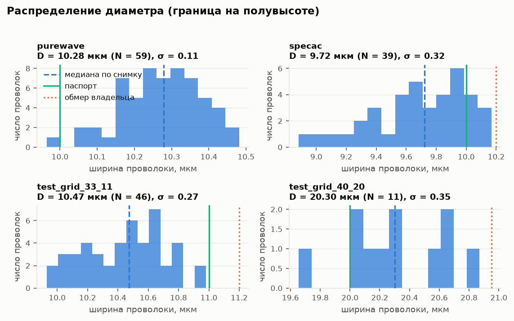{width=100%}

**Рис. 8. Распределение диаметра внутри образца.** Штриховая линия — медиана по снимку, сплошная зелёная — паспорт, пунктирная оранжевая — ваш обмер. Распределения узкие: ширина проволоки от проволоки к проволоке почти не меняется (σ = 0.11…0.35 мкм). Сравните с рис. 4, где положения гуляют на 3–5 мкм. Край проволоки виден резко — «размазаны» именно места, где проволоки стоят.

Значения CSV — узел `a18_csv_measurements.json`.

**Разбор расхождений.**

1. **Период по снимку систематически ниже вашего на 0.5–0.8 мкм** во всех четырёх случаях. Знак
   один и тот же, значит это не случайность. Наиболее вероятное объяснение: при ручном обмере
   промежутка легко захватить чуть больше, чем есть, а автоматический счёт по плотности такого
   смещения не имеет. Величина расхождения (2–3 %) сопоставима с расхождением двух моих
   собственных оценок (§10.1), так что настаивать на своей цифре как на единственно верной я не
   стал бы; для модели важнее, что обе ниже паспорта.
2. **`specac`: D = 14.0 в коде опровергнут.** Три независимых источника — паспорт 10.0, ваш обмер
   10.25, снимок 9.72 — согласуются между собой в пределах полумикрона, а код отстоит от них на
   4 мкм. Прежнее значение никогда не было измерением: это бликовая оценка 8–12, умноженная
   вручную на 1.9.
3. **`test_grid_40_20`: D = 18.0 в коде тоже неверен** — все три источника дают 20.0…20.9.
4. **`test_grid_33_11`: три источника на период сходятся** (32.5 / 31.71 / 31.82) — правка не
   нужна.
5. **Диаметр по снимку всегда меньше вашего** на 0.5–0.75 мкм. Это не разные образцы и не разные
   микроскопы — это разный уровень границы, см. §7.

---

## 7. Гипотеза о систематике «+0.2 мкм»

### 7.1 Что проверялось

Ваше наблюдение: обмеры на микроскопе давали ровно +0.2 мкм над паспортом на трёх образцах
(`specac` 10 → 10.2, `att-11-16` 11 → 11.2, `test_grid_33_11` 11 → 11.2). Решающий тест —
`test_grid_40_20` с паспортом 20: постоянный сдвиг снова даст +0.2, пропорциональный (2 %) даст
+0.4.

Результат по всем 14 записям `wgp-20-40_D.csv`: среднее **20.921**, СКО 0.525, стандартная ошибка
0.140, то есть **Δ = +0.921 мкм**.

- Гипотеза «постоянный +0.2»: t = **+5.14**, p = **0.0002** — отвергнута.
- Гипотеза «пропорциональный +2 % (+0.40)»: t = **+3.72**, p = **0.0026** — отвергнута.

Ни та, ни другая. На двух других образцах обе гипотезы неразличимы между собой:
`specac` Δ = +0.248, `test_grid_33_11` Δ = +0.060 — разброс слишком велик, чтобы их развести.

**Важно: ваше наблюдение не было ошибкой.** На медианах оно точно: `specac` медиана 10.2 при
паспорте 10, `test_grid_33_11` медиана 11.2 при 11 — ровно +0.2 в обоих случаях. Просто по
средним у `test_grid_40_20` эффект оказался вчетверо больше, и это вывело на его настоящую
природу, которую иначе бы не искали.

### 7.2 Настоящая причина — уровень границы, а не микроскоп

Скан порога (§3.8) показывает, насколько по-разному порог влияет на две величины:

| Образец | ΔP при уровне 0.20 → 0.80 | ΔD при том же |
|---|---|---|
| purewave | 0.0043 мкм (**0.018 %**) | 1.776 мкм (**17.3 %**) |
| specac | 0.0056 мкм (**0.023 %**) | 1.889 мкм (**19.5 %**) |
| test_grid_33_11 | 0.0015 мкм (**0.005 %**) | 1.782 мкм (**17.1 %**) |
| test_grid_40_20 | 0.0212 мкм (**0.057 %**) | 1.263 мкм (**6.3 %**) |

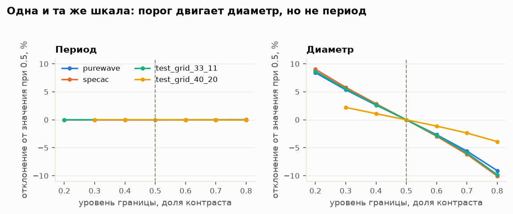{width=100%}

**Рис. 9. Одна и та же шкала: порог двигает диаметр, но не период.** Обе панели построены в одинаковом масштабе — в этом весь смысл рисунка. Слева период: линия строго на нуле, сдвиг уровня границы от 0.2 до 0.8 контраста не меняет его вообще. Справа диаметр: те же данные, тот же сдвиг — и разброс ±10 %. Отсюда вывод: период по этим снимкам измеряется надёжно, а диаметр существует только вместе с указанием конвенции края.

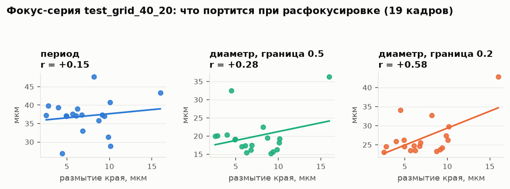{width=100%}

**Рис. 10. Фокус-серия: что портится при расфокусировке.** Проверка на реальных данных, а не на пороге: 19 кадров одного и того же участка с разной резкостью. Период (слева) от размытия не зависит — облако точек плоское. Диаметр по полувысоте (в центре) держится заметно лучше, чем диаметр по низкому порогу 0.2 (справа), который растёт вместе с размытием почти метр в метр. Ваша конвенция края ближе к правой панели — поэтому у некомпланарного `test_grid_40_20` расхождение с паспортом и оказалось самым большим.

Порог двигает диаметр в **300–3400 раз** сильнее, чем период (`threshold_effect`).

Отсюда объяснение: ваши обмеры соответствуют границе на уровне **0.1–0.33 контраста**, а не 0.50 —
клик приходится к подножию фронта, а не на его середину. Это даёт около +0.3 мкм на каждую
границу и +0.5…+0.75 мкм на диаметр — ровно наблюдаемые расхождения. У `test_grid_40_20` эффект
усилен расфокусировкой, потому что его проволоки некомпланарны.

**Проверка на фокус-серии** (те же проволоки, разная резкость, 19 кадров, `_summary`):

| Что | r | p | наклон |
|---|---|---|---|
| Период против размытия | +0.151 | 0.54 | +0.22 мкм на мкм |
| Диаметр при границе 0.5 против размытия | +0.284 | 0.24 | +0.49 |
| **Диаметр при границе 0.2 против размытия** | **+0.580** | **0.009** | **+0.89** |

Период не зависит ни от порога, ни от фокуса. Диаметр при низком пороге зависит значимо. То есть
измерять период по этим снимкам можно уверенно, а диаметр — только с указанием конвенции.

**Вывод: систематики микроскопа как отдельной сущности нет.** Есть конвенция границы и влияние
фокуса, и вместе они объясняют все три образца сразу. У диаметра круглой проволоки на этих
снимках вообще нет единственного значения: фронт занимает около 0.9 мкм даже на резком кадре
(`edge_rise_2080_um`), и выбор уровня двигает результат на ±0.8–1.0 мкм.

**Уточнение к первому заходу (ORCH).** Доверительные интервалы в отчёте A4 посчитаны по
нормальному приближению; корректно брать распределение Стьюдента при таком N. Пересчёт:
`test_grid_40_20` Δ = +0.921, 95 % ДИ **[+0.618, +1.225]** (было [+0.646, +1.196]);
`specac` +0.248 **[+0.166, +0.330]**; `test_grid_33_11` +0.060 **[−0.271, +0.391]**. Выводы не
меняются: нижняя граница интервала у решающего образца (+0.62) всё равно выше обеих проверяемых
гипотез.

---

## 8. Спектральный метод против метода по границам

До этой работы период оценивался по автокорреляции профиля яркости — по сути спектрально. Прямое
сравнение на одних и тех же кадрах (`frames[].p_autocorr_um` против `frames_summary[].P_density_um`):

| Образец | Промахов | Что выдавала автокорреляция | Правильно |
|---|---|---|---|
| purewave | 3 из 6 | 48.8 / 48.1 / 49.9 | ~24.5 |
| specac | 3 из 6 | 49.7 / 49.1 / 38.2 | ~25 |
| test_grid_33_11 | 1 из 7 | 61.3 | ~32 |
| test_grid_40_20 | 3 из 4 | 79.9 / 60.1 / 71.8 | ~37 |
| **Итого** | **10 из 23 (43 %)** | завышение в 1.5–2 раза | |

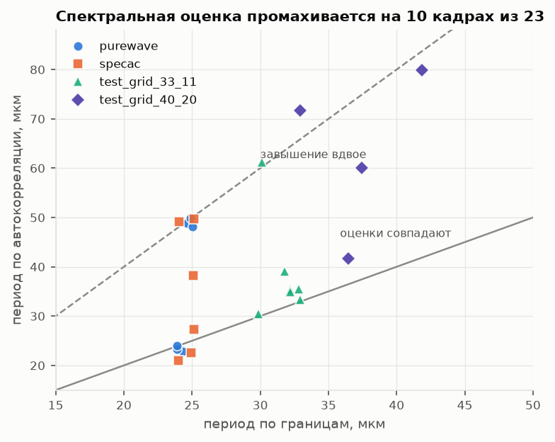{width=80%}

**Рис. 11. Спектральная оценка периода против метода по границам.** Каждая точка — один кадр. По горизонтали период, найденный по границам проволок, по вертикали — по автокорреляции профиля яркости. Сплошная линия — совпадение оценок, штриховая — завышение ровно вдвое. Десять кадров из двадцати трёх лежат у штриховой линии: спектральный метод «поймал» удвоенный период. Так же он вёл себя на `att-11-16`, и теперь понятно почему — виноват беспорядок решётки, а не её плотность.

(Пересчитано ORCH напрямую из артефактов; в отчёте A4 фигурировало «10 из 24» — разница в том,
что у одного кадра `test_grid_40_20` автокорреляционной оценки нет вовсе.)

**Механизм.** При разбросе периодов около 20 % пик автокорреляции на лаге в один период
размазывается, и пик на удвоенном периоде оказывается выше. Метод сбивается не там, где решётка
плотная, а там, где она **беспорядочная**.

**Следствие для `att-11-16`.** У него автокорреляция давала 62/103/146 пикселей вместо ожидаемых
~25, и это списывали на плотность решётки (`D/P ≈ 0.69`). Теперь видно, что причина другая —
беспорядок, тот же самый, что у остальных четырёх образцов. Значит **метод по границам должен
сработать и на трёх сохранившихся кадрах уехавшего прибора**, а это 4 точки из 8, держащие плечо
восьмиточечной подгонки закона H5 (эмпирическая связь эффективного диаметра с геометрическим).

---

## 9. Что это меняет в модели и в статье

### 9.1 Перезапуск подгонок

Период в модели Бланко зафиксирован жёстко (приколот), поэтому его сдвиг напрямую двигает
результат подгонки:

| Образец | Было в коде | Стало | Сдвиг | Нужен перезапуск |
|---|---|---|---|---|
| purewave | 25.5 | 24.44 | **−4.2 %** | **да** |
| test_grid_40_20 | 38.8 | 37.18 | **−4.2 %** | **да** |
| specac | 24.9 | 24.73 | −0.7 % | нет, в пределах погрешности |
| test_grid_33_11 | 31.82 | 31.71 | −0.3 % | нет |

### 9.2 Для зоны B (структура данных)

Строки готовы, файл геометрии **не правился** — это чужая зона:

```python
# A18/A19, микрофото владельца 2026-08-10, cal=0.126739 мкм/px.
# D_meas_um — граница на ПОЛУВЫСОТЕ (f=0.50). При конвенции владельца (f≈0.25) те же
# проволоки дают на +0.5...+0.75 мкм больше. Конвенцию указывать рядом с числом.
GEOMETRY_A18 = {
    "purewave":        {"P_um": 24.44, "P_se": 0.19, "D_pass_um": 10.0, "D_meas_um": 10.28, "sigma_pos_um": 3.21},
    "specac":          {"P_um": 24.73, "P_se": 0.22, "D_pass_um": 10.0, "D_meas_um":  9.72, "sigma_pos_um": 4.69},
    "test_grid_33_11": {"P_um": 31.71, "P_se": 0.47, "D_pass_um": 11.0, "D_meas_um": 10.47, "sigma_pos_um": 5.12},
    "test_grid_40_20": {"P_um": 37.18, "P_se": 1.83, "D_pass_um": 20.0, "D_meas_um": 20.30, "sigma_pos_um": 4.25},
    # att-11-16-*: новых микрофото НЕТ (прибор уехал). Значения не трогать.
}
```

Помимо самих значений нужны три структурные вещи: (1) три поля диаметра вместо одного —
паспортный, измеренный и эффективный, с явным указанием, какой из них стоит в знаменателе
отношения «эффективный к физическому»; (2) новое поле `sigma_pos_um` — это **измеренная**
величина, а не приор; (3) сама конвенция границы как метаданное рядом с числом.

### 9.3 Для зоны D (статья)

- Отношение «эффективный диаметр к физическому» и ось `D/P` — оси центрального рисунка Fig.4 и
  §4.3. Значения `D/P` меняются: **0.421 / 0.393 / 0.330 / 0.546** против прежних
  0.416 / 0.562 / 0.352 / 0.464. Сильнее всего поехал `specac` — из-за опровергнутого D = 14.0.
- Диапазон в заявке новизны №2 придётся пересчитать после утверждения таблицы.
- Появляется то, чего в статье не было: **измеренная** нерегулярность решётки (11–19 % периода)
  вместо предположения о ней. Гипотеза HN4 (нерегулярность как источник расхождения модели с
  экспериментом) остаётся отвергнутой — измеренные значения лежат внутри уже просканированного
  диапазона (до 30 % периода, фактор Дебая — Валлера 0.995), — но теперь это опирается на
  измерение, а не на оценку.
- Заявка новизны №1 (`D/P = 0.69` для плотного образца, за объявленной Бланко границей
  применимости) **не страдает**: она стоит на `att-11-16`, чей паспорт подтверждён, а новых
  микрофото для него нет.

---

## 10. Ограничения и оговорки

### 10.1 Две оценки периода расходятся сильнее, чем заявленная погрешность

Главная оговорка работы. В артефактах лежат две независимые оценки периода:

| Образец | `P_density` (отчётная) | `P_best` | Расхождение | Заявленная ошибка |
|---|---|---|---|---|
| purewave | 24.440 | 24.304 | 0.136 (0.6 %) | ±0.19 |
| specac | 24.725 | 24.442 | 0.283 (1.2 %) | ±0.22 |
| test_grid_33_11 | 31.712 | 31.218 | 0.494 (1.6 %) | ±0.47 |
| test_grid_40_20 | 37.177 | 37.327 | 0.150 (0.4 %) | ±1.83 |

У `test_grid_33_11` расхождение **превышает** заявленную стандартную ошибку, у `purewave`
сопоставимо с ней. Значит формальная ошибка среднего занижает реальную неопределённость: она
описывает разброс между кадрами, но не систематику самого способа счёта. При перезапуске подгонок
(§9.1) неопределённость периода следует брать с этим запасом — иначе доверительные интервалы
параметров выйдут занижёнными, а период в модели приколот.

### 10.2 Прочее

- **`test_grid_40_20`: N = 11 проволок** на диаметр и всего 2 принятых мультифокусных кадра. Это
  самая слабая статистика в работе; частично компенсировано фокус-сериями (19 кадров), но образец
  остаётся наименее надёжным.
- **Калибровка не проверена** — калибровочной шкалы в поставке нет. Все относительные выводы
  (нерегулярность, независимость периода от порога, доля промахов автокорреляции) от неё не
  зависят. Абсолютные `P` и `D` зависят линейно: ошибка калибровки в 1 % сдвинет их все на 1 %
  в одну сторону.
- **Периодичность отклонений недоступна** — 6–11 проволок в кадре (§5.5).
- **`purewave`: диаметр не с чем сверить** — `_D.csv` в поставке нет, сравнение только с паспортом
  и старым значением в коде.
- **Двугорбость гистограмм** периодов у `purewave` и `test_grid_33_11` — наблюдение, не вывод;
  у `purewave` частично артефакт перекрытия кадров.
- **`att-11-16` не обрабатывался** — новых снимков нет, к трём старым метод не применялся (задача
  не ставилась). Прогноз по нему — в §8.

---

## 11. Что дальше

**Требует вашего решения** (`coordination/QUESTIONS.md`, строки A-1…A-3):

| # | Вопрос | Цена решения |
|---|---|---|
| **A-1** | Какую конвенцию границы принять за «измеренный диаметр» проекта | Диаметр меняется на 6–20 % в зависимости от ответа. Это знаменатель отношения `D_eff/D_phys` — центральной величины §4.3 и Fig.4. Без явной конвенции число в статье невоспроизводимо |
| **A-2** | Когда перезапускать подгонки `purewave` и `test_grid_40_20` | Если после утверждения таблицы — работа делается один раз; если сейчас — возможно, дважды |
| **A-3** | Снимать ли калибровочную шкалу в кадре при следующей съёмке | Сейчас все абсолютные значения опираются на непроверяемое число |

**Очередь работ после ответов:**

1. Зона B — структура на три диаметра плюс поле разброса положений (§9.2).
2. Зона A — перезапуск подгонок двух образцов, затем **однократный** пересчёт закона H5 на полном
   наборе.
3. Зона A — применить метод по границам к трём сохранившимся кадрам `att-11-16` (§8): это
   единственный оставшийся путь к его периоду.
4. Зона D — §4.3, §4.7, Fig.4 и диапазон в заявке новизны №2 (§9.3).
5. При следующей съёмке: калибровочная шкала в кадре и, если нужна периодичность отклонений,
   кадры с меньшим увеличением либо сшивка соседних.

---

## 12. Приложение: состав артефактов

Каталог `research/results/a18_microscopy/`.

| Файл | Содержимое |
|---|---|
| `a18_<набор>.json` | Полный результат по образцу: покадровые сводки (`frames_summary`), сырые данные кадров (`frames`), объединённая статистика (`pooled`), скан порога (`threshold_scan`, `threshold_effect`), структура отклонений (`structure`), нуль-модель (`null_model_iid`), оценки периода (`P_density`, `P_best_um`) |
| `a18_csv_measurements.json` | Разбор ваших CSV: значения, робастная статистика до и после чистки выбросов, гистограммы `_P_stat`, сверка с паспортом |
| `a18_test_grid_40_20_focus.json` | Фокус-серии: покадрово по каждой серии + сводка корреляций «резкость против периода и диаметра» |
| `a18_<набор>_frame0.png` | Разбор одного кадра: профиль яркости, найденные границы и центры |
| `a18_<набор>.png` | Сводка по образцу: распределение периодов, вектор отклонений, распределение диаметров |
| `a18_test_grid_40_20_focus.png` | Период и диаметр в зависимости от степени расфокусировки |
| `SUMMARY.md` | Краткий свод чисел на одну страницу |
| `REPORT_A19_2026-08-10.md` | Этот отчёт |

Скрипт: `research/two_wgp/a18_microscopy_lattice.py` (1195 строк, подкоманды — §3.9).
Журнальная запись: `research/logs/RESEARCH_LOG.md`, тег `[A]`, 2026-08-10.
Карта исходных данных: `data_pool/MICROSCOPY.md`.

**Ключевые узлы JSON для перепроверки любого числа из отчёта:** `P_density.mean/sem` (период),
`pooled.D.median` (диаметр), `pooled.dev.std` и `pooled.ratio_std_over_P` (нерегулярность),
`threshold_effect.dP_um` / `dD_um` (влияние границы), `structure` против `null_model_iid`
(беспорядок против дрейфа), `frames[].p_autocorr_um` (спектральная оценка для сравнения).
